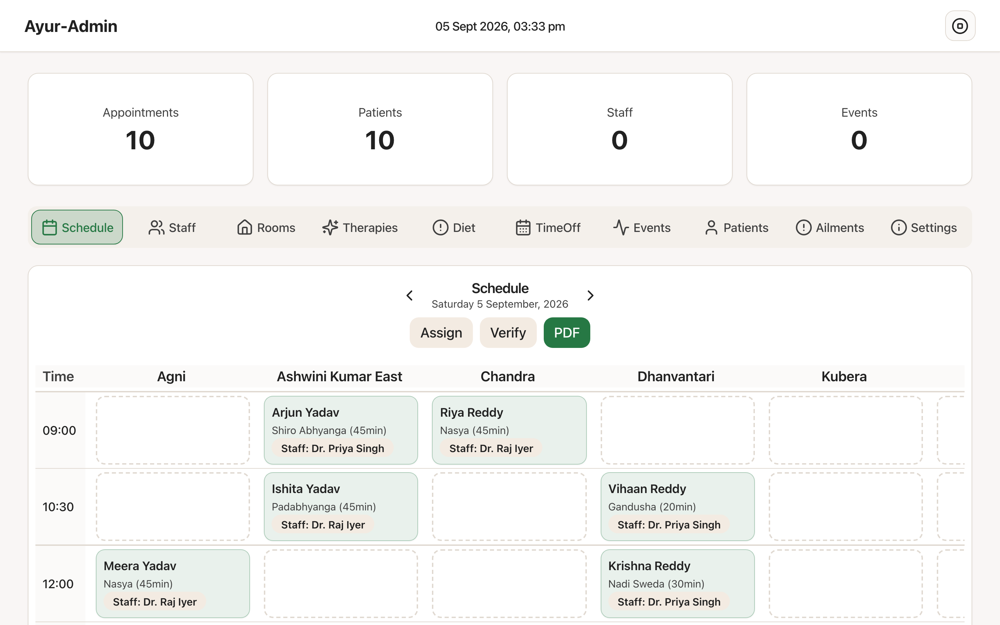

# AyurCalm Scheduler

[](https://github.com/jpysh/ayurcalm-scheduler/actions/workflows/ci.yml)
[](LICENSE)
[](CONTRIBUTING.md)

Self-hosted appointment and therapy scheduler for Ayurveda centres, therapy and
massage studios, and wellness retreats.

Plan a centre's day in one place: clients and their stays, therapists, treatment
rooms, therapy definitions, recurring programme events, and the appointments that
tie them together. An auto-assign pass fills the schedule while respecting room
amenities, therapist availability, and time off.

**Who it's for.** Built first for residential Ayurveda centres, where a guest
stays for days and needs a coherent daily programme rather than isolated bookings.
That shape fits any practice juggling several therapists, several treatment rooms
and treatments of differing length — massage and therapy studios, physiotherapy
practices, spas and wellness retreats. Nothing in the data model is specific to
Ayurveda: therapies, rooms and their amenities are all defined by you.



*Running on seeded demo data — one `docker compose up` away.*

## Quick start

You need [Docker](https://docs.docker.com/get-docker/). Nothing else.

```bash
git clone https://github.com/jpysh/ayurcalm-scheduler.git
cd ayurcalm-scheduler
docker compose up -d
```

Open **http://localhost:8080** and sign in:

| Email | Password |
|---|---|
| `admin@example.com` | `demo1234` |

The first boot creates the database, applies migrations, and seeds a demo centre —
patients, therapists, rooms, therapies, a week of appointments, and a daily
programme. Restarts keep your data; the seed only runs against an empty database.

> **Change the demo password before putting this on a network.** The server prints
> a warning on every startup while the default is still in place.

To stop, `docker compose down`. To start over from scratch,
`docker compose down -v` (this deletes the database volume).

## Setting up your centre

Everything about your business is configured in the app, not in files — sign in
as an administrator and open **Settings**:

- **Centre details** — name, address and logo, shown in the app and on the printed
  daily schedule
- **Opening hours** — opening and closing time, slot length and working days.
  These decide which time rows the schedule shows, so set them before entering
  appointments
- **Timezone**

Staff, therapists, treatment rooms and therapies are managed in their own tabs.

When you are ready to replace the seeded example centre with your own, use
**Settings → Clear demo data**. It removes the demo patients, staff, rooms,
therapies and appointments, and keeps your account and centre settings.

## Configuration

These are install-time settings for whoever deploys the app. Copy `.env.example`
to `.env` if you want to change any — the defaults work as-is for a local trial.

| Variable | Default | Purpose |
|---|---|---|
| `APP_PORT` | `8080` | Host port the app is served on |
| `POSTGRES_USER` / `POSTGRES_PASSWORD` / `POSTGRES_DB` | `ayurcalm` | Database credentials |
| `JWT_SECRET` | *(random per restart)* | Session signing secret. Set it (`openssl rand -base64 32`) so sessions survive restarts |
| `CENTRE_NAME` | `Wellness Centre` | Centre name used on first run only; after that it is edited in **Settings** |

## What's inside

| Layer | Stack |
|---|---|
| Front end | React 18, Vite, TypeScript, Tailwind, shadcn/ui |
| API | Express, Prisma, Zod, JWT auth |
| Database | PostgreSQL 16 |
| Tests | Playwright (end-to-end), Vitest (server) |

One container serves both the API and the built front end, so a self-hosted
install is two containers total.

## Features

- **Scheduling** — appointments across therapists, rooms and therapies, with
  conflict detection
- **Auto-assign** — fills open slots against amenity requirements and availability
- **Patients and stays** — patient records, arrival/departure windows, diet plans
- **Time off** — centre holidays, per-therapist leave, room and therapy blocks
- **Programme events** — recurring daily activities (yoga, meals, meditation) and
  one-off sessions
- **Daily schedule PDF** — printable day sheet
- **Audit log** — records changes to scheduling data

## Status and roadmap

Version 0.1.0 — usable, and in active development by a single maintainer. Two
areas are known to be unfinished:

- **Diet plans** (the Diet tab) are incomplete
  ([#6](https://github.com/jpysh/ayurcalm-scheduler/issues/6))
- **Daily schedule PDF** formatting needs work
  ([#7](https://github.com/jpysh/ayurcalm-scheduler/issues/7))

Everything else in the feature list above works. Issues and feature requests are
welcome — see [open issues](https://github.com/jpysh/ayurcalm-scheduler/issues),
or start a thread in
[Discussions](https://github.com/jpysh/ayurcalm-scheduler/discussions) if you are
not sure whether something is a bug.

## Development

Runs the front end and API separately with hot reload.

```bash
# Database only
docker compose up -d db

# API — http://127.0.0.1:4000
cd server
npm install
cp .env.example .env      # if present; otherwise set DATABASE_URL
npx prisma migrate deploy
npx tsx src/seed.ts
npm run dev

# Front end — http://localhost:5173
cd ..
npm install
npm run dev
```

The front end always calls `/api` on its own origin. In development the Vite dev
server proxies that to `http://localhost:4000` (override with
`VITE_API_PROXY_TARGET`); to point the built app at a different host entirely,
set `VITE_API_BASE`.

```bash
npm run test:e2e          # Playwright
cd server && npm run test:smoke
```

## Security

Login is server-side: bcrypt password hashes in Postgres, JWT sessions, and every
API route except `/api/health` and `/api/auth/login` requires a valid token.

This is a small project maintained by one person. It has not had an external
security audit. Do not put it on the public internet without putting your own
authentication layer, TLS and backups in front of it. See
[SECURITY.md](SECURITY.md) to report a vulnerability.

## Contributing

Issues and pull requests are welcome — see [CONTRIBUTING.md](CONTRIBUTING.md).
Bug reports and feature requests both have templates that will prompt you for
what's needed.

## License

[MIT](LICENSE) © jpysh
