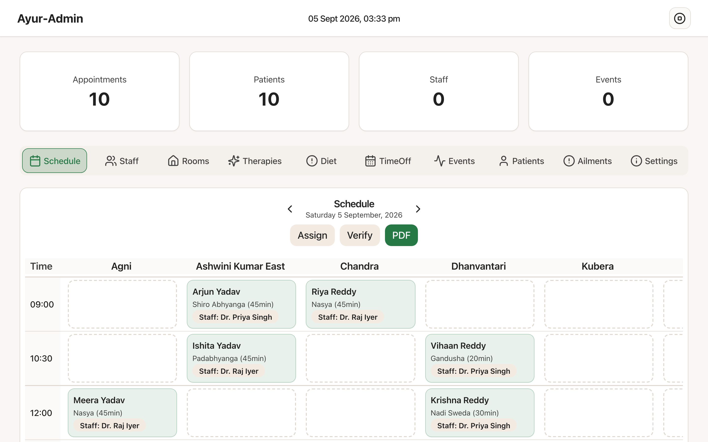

# Ruta

[](https://github.com/jpysh/ayurcalm-scheduler/actions/workflows/ci.yml)
[](LICENSE)

**Your centre's day, printed and ready by 7 am.** Open-source scheduling for Ayurveda centres, therapy studios and wellness retreats.

[Website](https://jains.es/ruta) · [Live demo](https://demo.jains.es) · [Free cloud trial](https://signup.jains.es) · [Self-host guide](docs/self-host.md) · [Admin guide](docs/admin-guide.md)

Plan residents and their stays, therapists, rooms, therapies and daily programme in one place. Auto-assign fills the day around room amenities, therapist time off and opening hours, and the day sheet prints every resident's treatments and meals for the notice board. Built for residential Ayurveda centres; nothing in it is Ayurveda-specific.



## Cloud or self-host?

Same app, same features. The difference is who runs it.

| | Self-host | Ruta Cloud |
|---|---|---|
| Price | Free | Monthly per centre, [see pricing](https://jains.es/ruta) |
| Hosting, HTTPS, backups, updates | You | Us |
| Support by WhatsApp, email or phone | Community | Included |
| Setup help with your therapies, rooms and rota | No | Included |

You can move between them at any time and always leave with your data.

## Quick start

You need [Docker](https://docs.docker.com/get-docker/).

```bash
git clone https://github.com/jpysh/ayurcalm-scheduler.git
cd ayurcalm-scheduler
docker compose up -d
```

Open **http://localhost:8080** and sign in as `admin@example.com` / `demo1234`. The first boot seeds an example centre (about 40 residents a day), and a setup wizard asks for your centre's name and hours. Change the password before putting it on a network.

Running it for a real centre, with HTTPS and backups: [docs/self-host.md](docs/self-host.md).

## Stack

React, Vite and TypeScript front end; Express, Prisma and PostgreSQL 16 API; Playwright end-to-end tests. Two containers in total.

## Contributing

Issues, ideas and pull requests welcome: [CONTRIBUTING.md](CONTRIBUTING.md). Security reports: [SECURITY.md](SECURITY.md). Not sure if it's a bug? Ask in [Discussions](https://github.com/jpysh/ayurcalm-scheduler/discussions).

## License

[MIT](LICENSE) © jpysh
