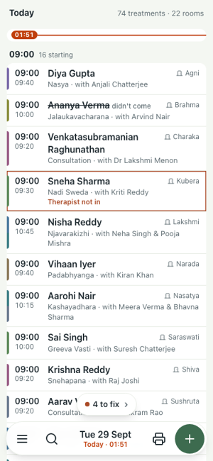
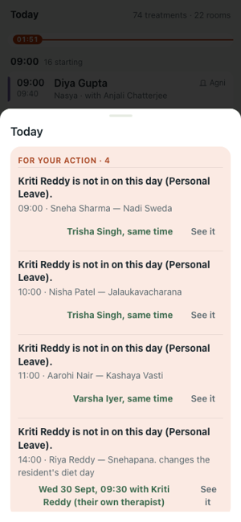
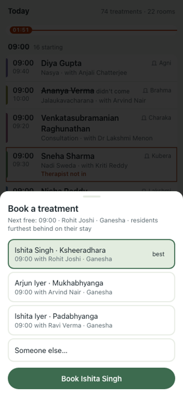
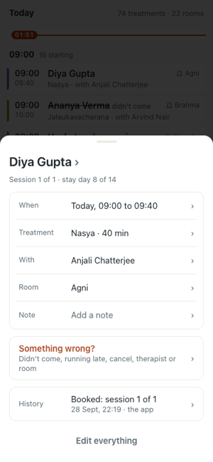
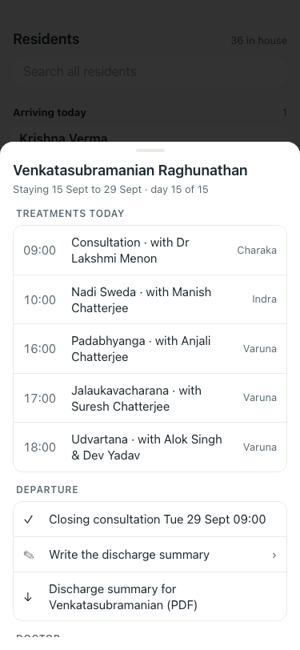
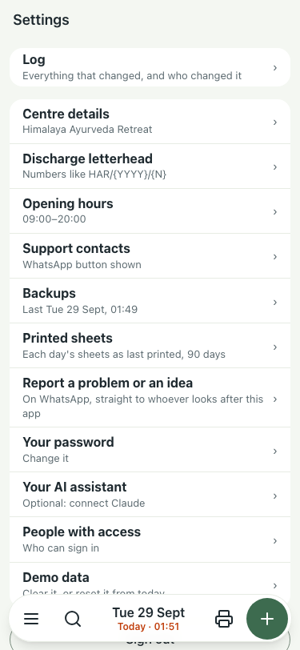

# Ruta on your phone: the daily jobs

One page for the person running the centre. Sign in on your phone; everything below starts from the bar at the bottom: **☰ menu · 🔍 search · the day · 🖨 print · ＋ book**.

| | |
|---|---|
|  | **1. See today.** The app opens on today: every treatment in time order, the red line is now. A treatment with a red box has a problem, and the pill at the bottom says how many ("4 to fix"). Tap the day in the bar to see another day. |
|  | **2. Fix the day.** Tap the pill. Each problem comes with the app's best answer already chosen (another therapist, the same time). Tap it to accept, or *See it* to choose. A therapist who is not in: open any of their treatments → *Something wrong?* → *Therapist not in*. |
|  | **3. Book a treatment.** Tap ＋. The next free slot and the residents furthest behind on their stay are offered first; tap one and *Book*. *Someone else…* for anyone not listed. |
|  | **4. Change one treatment.** Tap it. Change the time, therapy, therapist or room from the lists, add a note, or *Something wrong?* for didn't come, running late or cancel. *History* shows every change. |
|  | **5. A resident.** ☰ → *Residents* lists who is arriving, staying and leaving today. Their card has today's treatments and meals, arrival (vitals, first consultation, diet), and in the last two days *Departure*: write the discharge summary and download its PDF. |
|  | **6. Print, backups, help.** 🖨 prints today's resident and therapist sheets for the notice board; ☰ → *Settings* → *Printed sheets* keeps each day's copy for 90 days. *Backups* shows last night's backup and downloads it: keep a copy on your phone. |

**A problem or an idea?** ☰ → *Settings* → *Report a problem or an idea* opens WhatsApp to whoever looks after this app, with the message started for you. The *Feedback* link at the foot of the page does the same.
