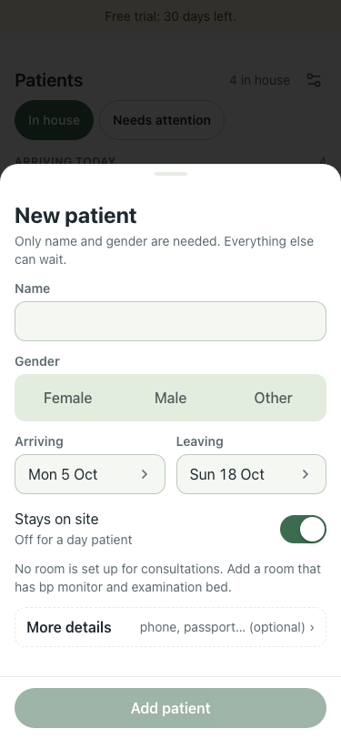
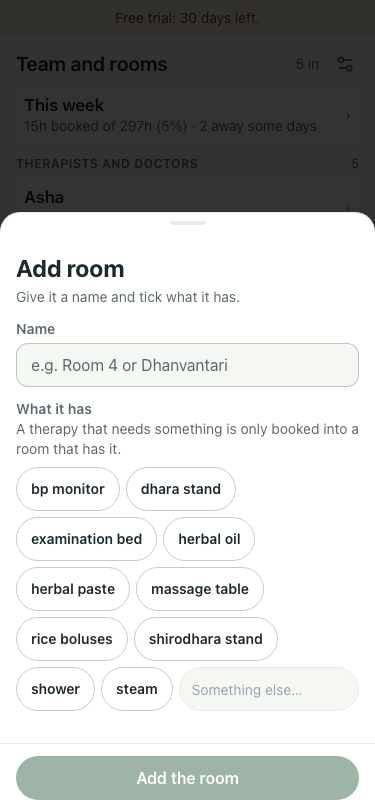

# Consultation rooms, 5 Oct (375×812, trial stack)

| # | Check | Result |
|---|---|---|
| 01 | New patient, no room has a BP monitor and examination bed: the form says "No room is set up for consultations. Add a room that has bp monitor and examination bed." | pass  |
| 02 | Add room starts with nothing ticked ("Something else…" adds equipment) | pass, 0 ticked  |

Decision: a consultation needs a room with its own equipment (library: bp_monitor, examination_bed); any other room is never offered. Done by amenities, no new "room type".
