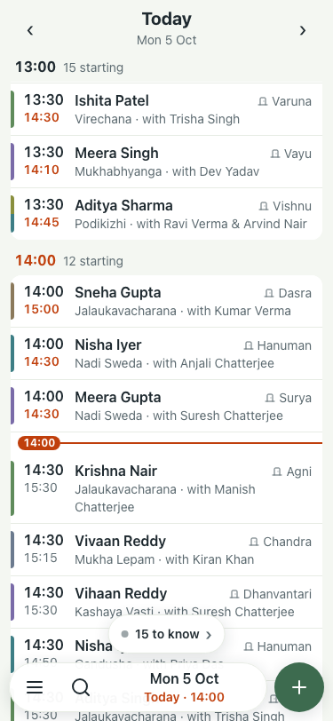
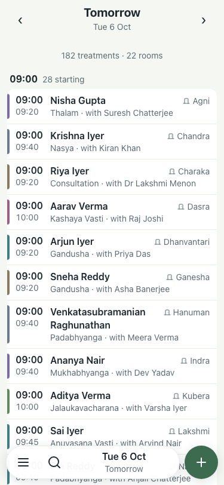
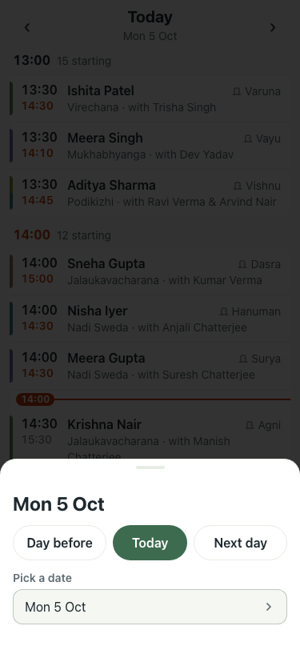
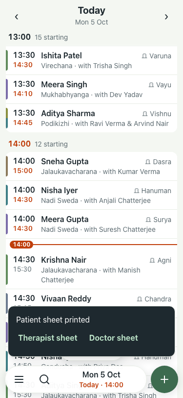

# UAT 2026-10-05-day-nav

Base http://localhost:8091, 375x812. Written by scripts/uat.mjs.

| # | Step | Result | Read off the page | Shot |
|---|---|---|---|---|
| 01 | The bar on the day: Menu, Search, the date with room around it, +. No Print | pass | date button 169px wide, no Print in the bar |  |
| 02 | The ‹ and › in the day header move one day | pass | Today to Tomorrow |  |
| 03 | Date sheet: Day before, Today, Next day each on one line | pass | button heights 44, 44, 44 |  |
| 04 | Menu has "Print the day's sheets" and it downloads the PDF | pass | ayurcalm-daily-schedule-2026-10-05.pdf |  |
