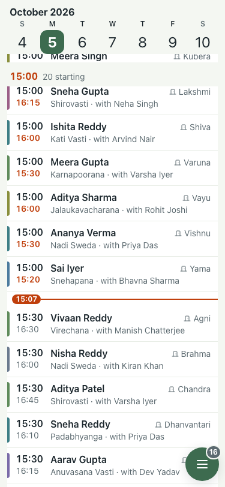
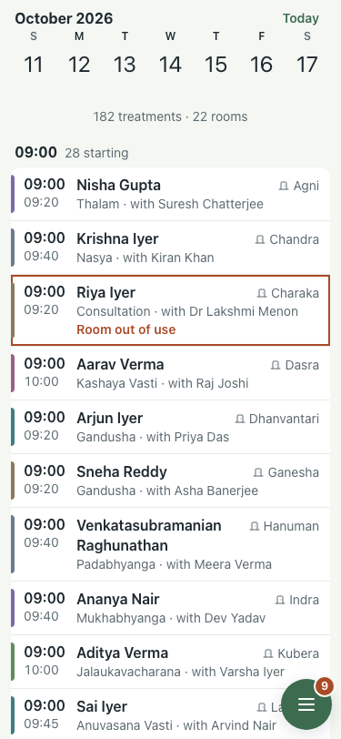
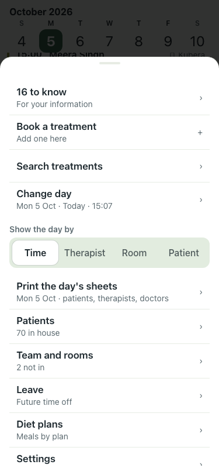
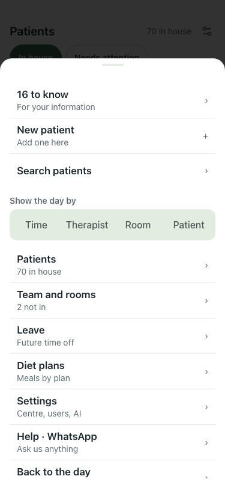
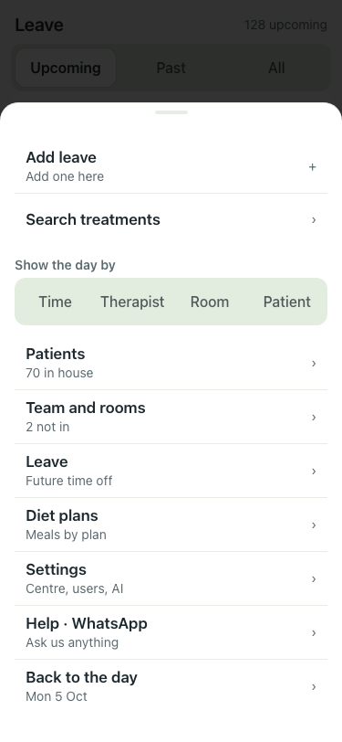
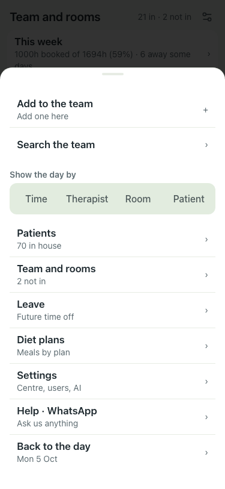
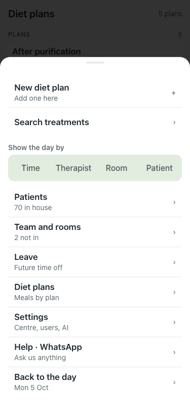
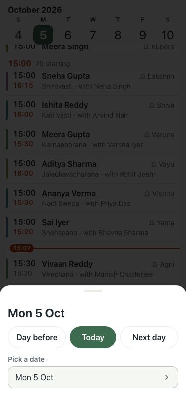

# UAT 2026-10-05-hamburger

Base http://localhost:8091, 375x812. Written by scripts/uat.mjs.

| # | Step | Result | Read off the page | Shot |
|---|---|---|---|---|
| 01 | The day: one hamburger bottom right (with the count), a week strip on top | pass | 1 bar button, 371 day buttons, chosen: Mon 5 Oct |  |
| 02 | Tap another day in the strip; swipe to the next week | pass | Mon 5 Oct to Tue 6 Oct; the strip scrolls a week |  |
| 03 | Menu: needs-you row, Book a treatment, Search, Change day, Print, screens | pass | Menu | 16 to know | For your information | › | Book a treatment | Add one here | + | Search treatments |  |
| 04 | Patients: same single button in the same place, its + row in the Menu | pass | button at 365,802 (day 365,802); "New patient" row present |  |
| 05 | Leave: same single button in the same place, its + row in the Menu | pass | button at 365,802 (day 365,802); "Add leave" row present |  |
| 06 | Team: same single button in the same place, its + row in the Menu | pass | button at 365,802 (day 365,802); "Add to the team" row present |  |
| 07 | Diet: same single button in the same place, its + row in the Menu | pass | button at 365,802 (day 365,802); "New diet plan" row present |  |
| 08 | Menu, Change day: jump to any date (Day before, Today, Next day, calendar) | pass | day sheet opened from the Menu |  |
