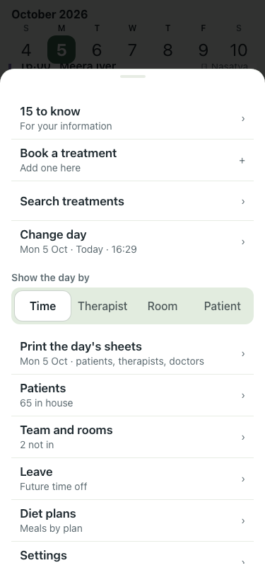
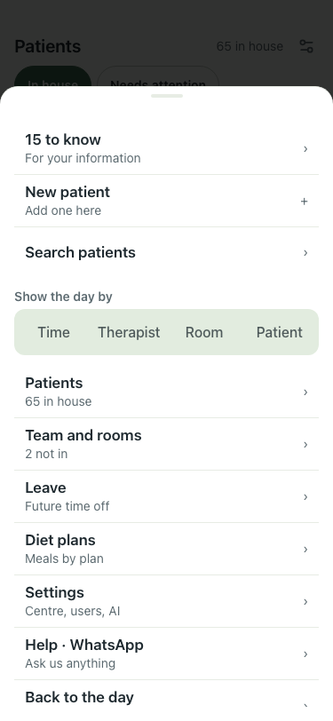
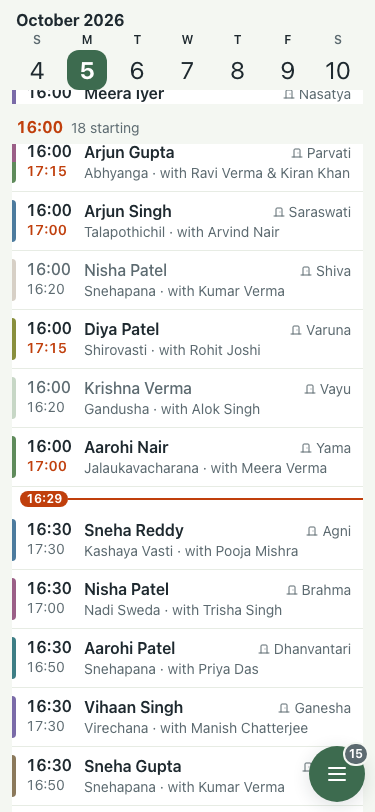

# UAT 2026-10-05-menu-polish

Base http://localhost:8091, 375x812. Written by scripts/uat.mjs.

| # | Step | Result | Read off the page | Shot |
|---|---|---|---|---|
| 01 | Menu on the day: Book a treatment is the one filled button; no "Back to the day"; Show by is there | FAIL | filled Book button 0, order: Menu | 15 to know | For your information | › | Book a treatment | Add one here |  |
| 02 | Menu on Patients: New patient is the filled button, "Back to the day" is there, no Show by | FAIL | Menu | 15 to know | For your information | › |  |
| 03 | Week strip: a rule under it, and the month follows a swipe to another month | FAIL | TimeoutError: locator.evaluate: Timeout 30000ms exceeded. |  |
| 04 | Needs-you row sits above the Book button when something needs fixing | pass | nothing needs fixing on the seeded day (170 treatments); info row sits under the actions |  |
