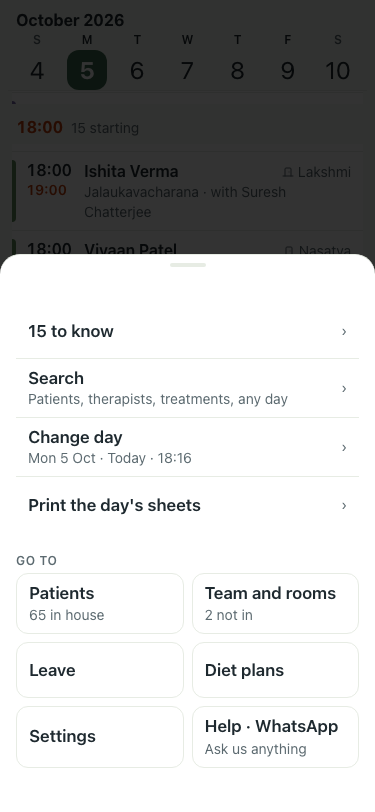
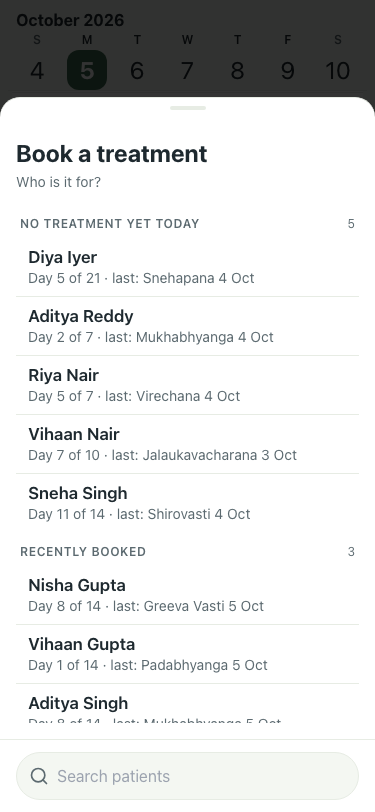
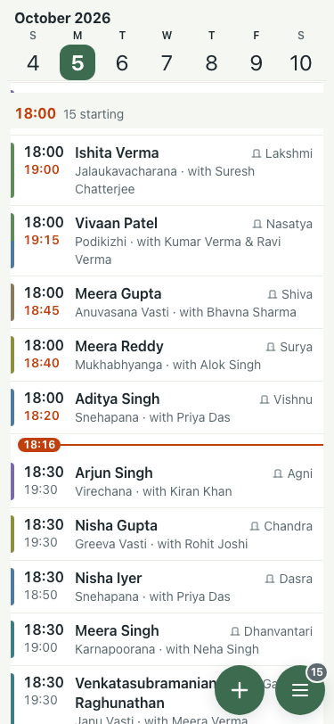
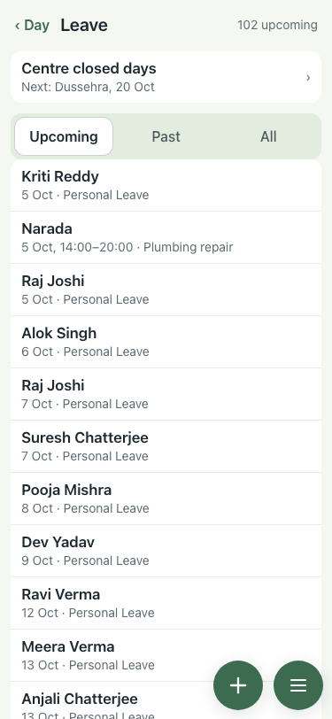
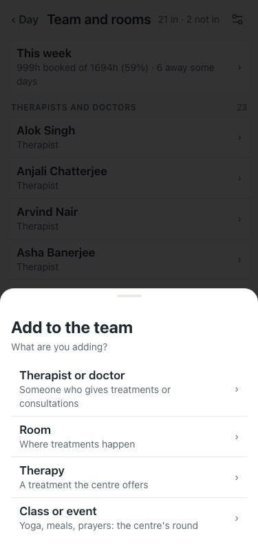
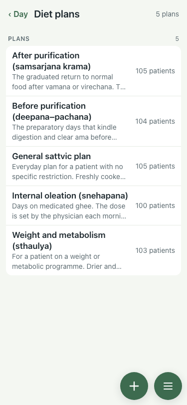
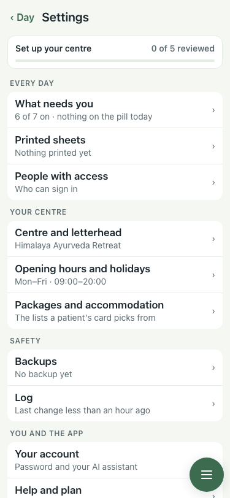

# UAT 2026-10-05-nav

Base http://localhost:8098, 375x812. Written by scripts/uat.mjs.

| # | Step | Result | Read off the page | Shot |
|---|---|---|---|---|
| 01 | Day: a filled + (Book a treatment) beside the menu, no ‹, and the Menu no longer repeats Book | pass | + 1, ‹ 0; menu: Menu | 15 to know | › | Search | Patients, therapists, treatments, any day | › |  |
| 02 | Day: tapping + opens the booking sheet | pass | Book a treatment | Who is it for? | NO TREATMENT YET TODAY | 5 |  |
| 03 | Leave: ‹ Day and + Add leave; + opens the sheet; ‹ Day returns to the day | pass | header/+ true, sheet true, back on the day true |  |
| 04 | Patients opened from Leave: ‹ Leave returns to Leave; + is New patient | pass | ‹ Leave 1, + 1, back on Leave true |  |
| 05 | Team and rooms: + opens the "what are you adding" sheet | pass | Add to the team | What are you adding? | Therapist or doctor | Someone who gives treatments or consultations | › |  |
| 06 | Diet plans: ‹ Day and + New diet plan | pass | ‹ and + present: true |  |
| 07 | Settings: ‹ Day, no + | pass | ‹ 1, bar buttons 1 (the menu only) |  |
| 08 | Diet plans, scrolled to the end: the last row is clear of + and the menu | pass | last row bottom 552, + top 746 |  |
