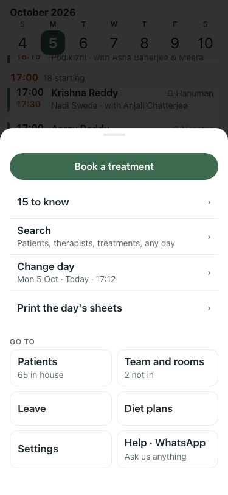
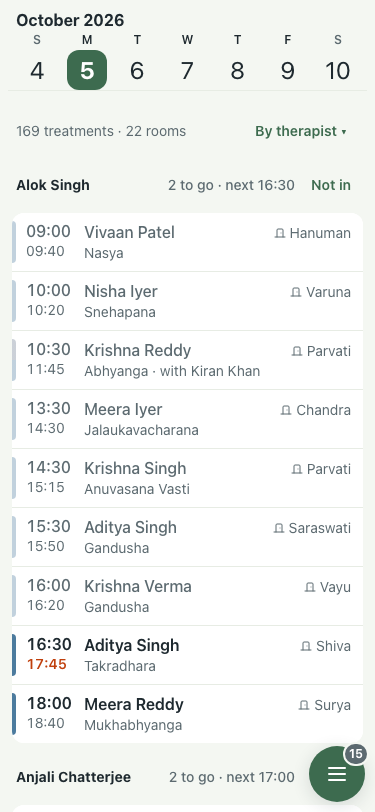
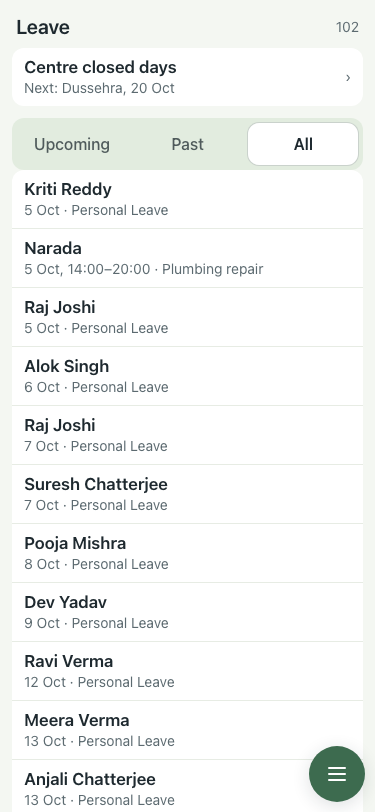
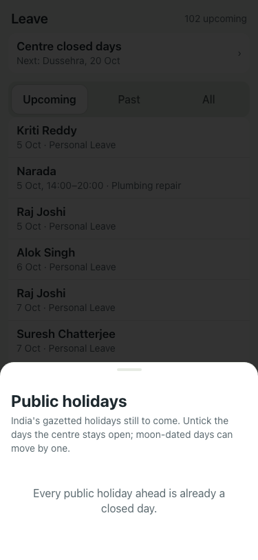

# UAT 2026-10-05-view-and-leave

Base http://localhost:8097, 375x812. Written by scripts/uat.mjs.

| # | Step | Result | Read off the page | Shot |
|---|---|---|---|---|
| 01 | Menu on the day: Book is the filled button, Search says Search, no view switch, no "Back to the day" | pass | Menu | Book a treatment | 15 to know | › | Search | Patients, therapists, treatments, any day | › | Change day |  |
| 02 | The day: a "By time" chip beside the count opens the grouping, and choosing Therapist regroups | pass | Show the day by, now Therapist |  |
| 03 | Leave: the team's leave only, with one row for the centre's closed days | pass | Centre closed days | Next: Dussehra, 20 Oct |  |
| 04 | Centre closed days opens the holidays sheet | pass | Public holidays | India's gazetted holidays still to come. Untick the days the centre stays open; moon-dated days can move by one. | Every public holiday ahead is already a closed day. | Close |  |
