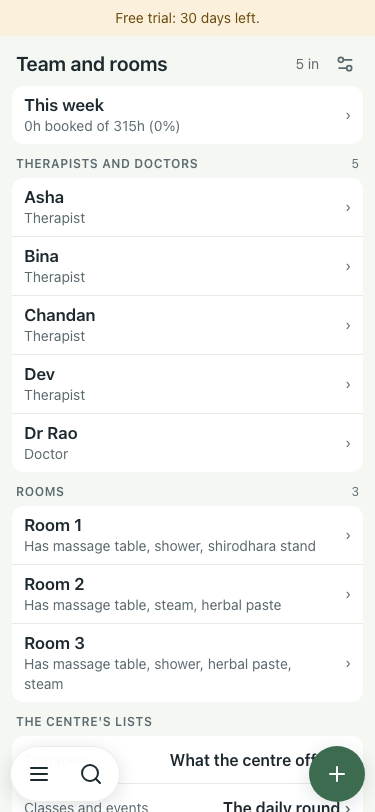
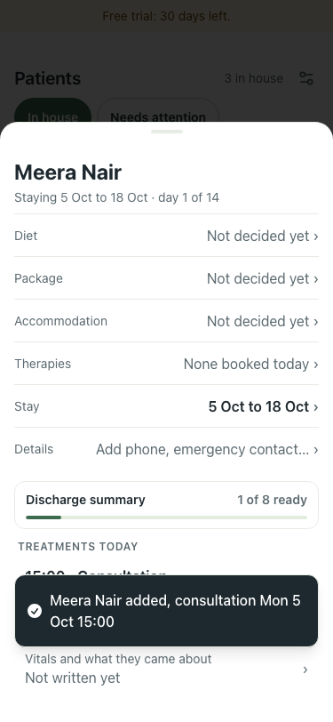
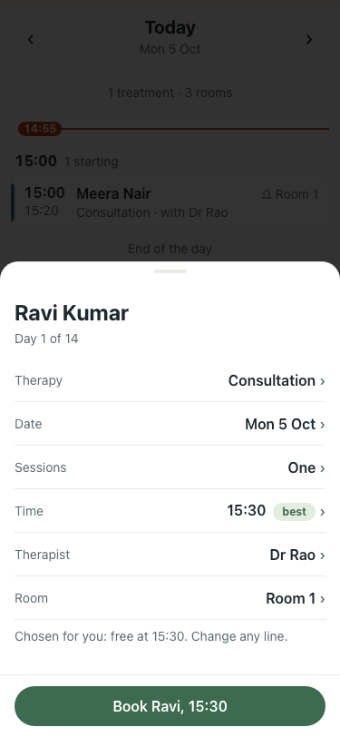
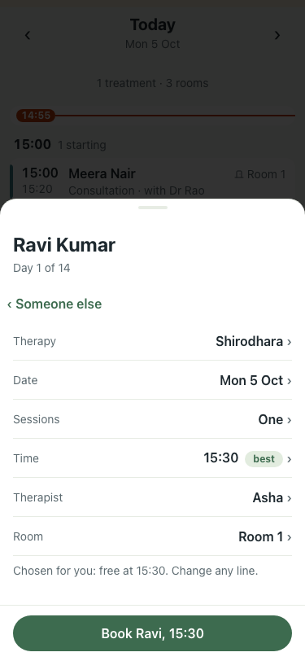
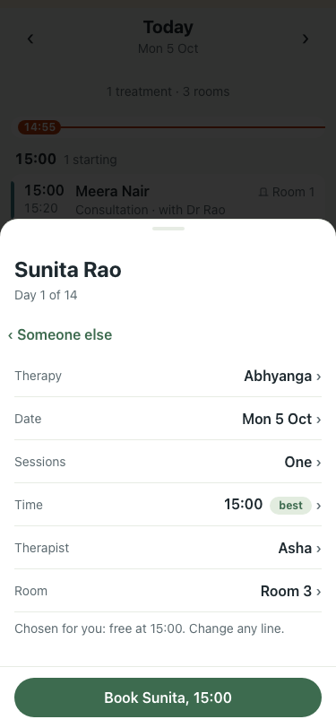
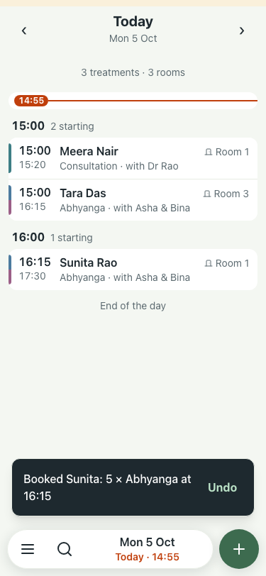
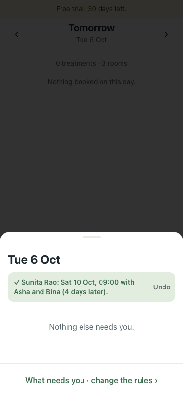
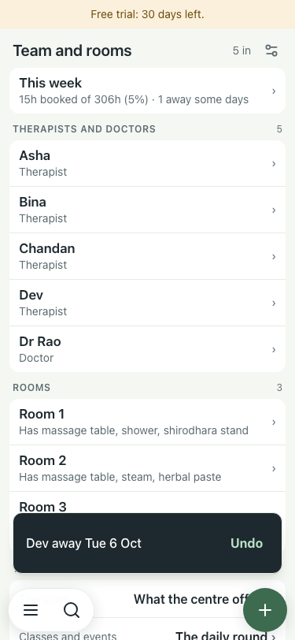

# UAT 2026-10-05-walk-fixes

Base http://localhost:8391, 375x812. Written by scripts/uat.mjs.

| # | Step | Result | Read off the page | Shot |
|---|---|---|---|---|
| 01 | Team: "This week" counts hours for a team whose hours were never set | pass | 0h booked of 315h |  |
| 02 | New patient: a doctor is free, so the consultation is pre-booked (no "No doctor is free") | pass | no warning; card: Mon 5 Oct 15:00 · Dr Rao |  |
| 03 | A resident with no consultation: "book one" opens the sheet on Consultation | pass | Therapy line reads Consultation |  |
| 04 | Booking sheet, 40 therapies: the Therapy line is a search (type "shiro") | pass | 2 rows for "shiro" (04-search.png); Therapy line then reads Shirodhara |  |
| 05 | Two-therapist therapy: both women are offered, no "needs 2 therapists and has 1" | pass | Asha | Bina | Chandan · Abhyanga is given by therapist | Dev · Abhyanga is given by therapists of |  |
| 06 | A five-day course starts at the time the sheet and the toast promise | pass | sheet promised 16:15, booked 16:15 |  |
| 07 | Replan after a leave: the moved session never doubles a day of the same course | pass | moved to "Sat 10 Oct, 09:00 with Asha and Bina (4 days later)"; days with two: none |  |
| 08 | Leave toast says who is away and when | pass | Dev away Tue 6 Oct |  |
