# UAT booking from + (#330)

Base http://localhost:8100, 375x812. Written by scripts/uat-330.mjs; it seeds its own "Uat" people and therapies. The hours-over step needs the centre's clock past closing.

| # | Step | Result | Read off the page | Shot |
|---|---|---|---|---|
| 01 | Open + and choose Meera: no therapy is chosen, the list shows facts, Book says Choose a therapy | pass | Meera Uatj88 Day 2 of 14 ‹ Someone else Date Wed 7 Oct › Choose a therapy Other therapies › Choose a therapy Close | 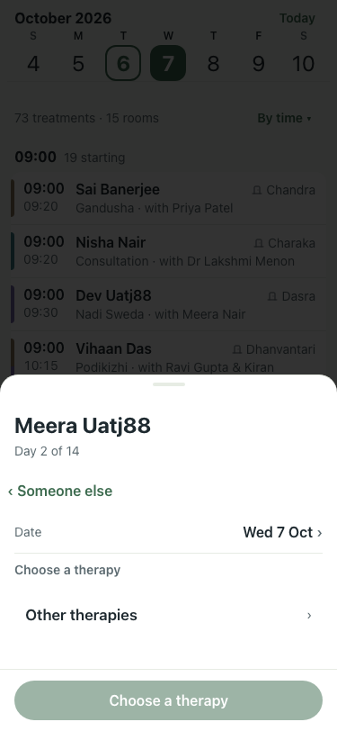 |
| 02 | Choose Mukha Lepam: the best time, therapist and room fill in; Days in a row has chips | pass | Meera Uatj88 Day 2 of 14 ‹ Someone else Date Wed 7 Oct › Therapy Mukha Lepam › Days in a row One 3 5 7 14 Other Time 09:00best › 09:00 · best 09:15 09:30 09:45  | 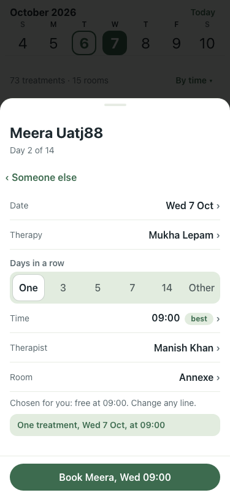 |
| 03 | Book: the sheet stays on Booked with Add another, Done and Undo (the note with Undo comes when it closes) | pass | Booked Meera Uatj88 Mukha Lepam at 09:00. Meera has 1 that day. Add another Done Undo Close | 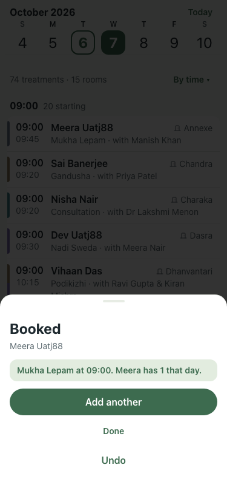 |
| 04 | Add another: the same patient, no therapy chosen; Mukha Lepam is greyed "already at"; choosing it warns | pass | Meera Uatj88 Day 2 of 14 ‹ Someone else Date Wed 7 Oct › Choose a therapy Mukha Lepam already at 09:00 Other therapies › Choose a therapy Close || Meera Uatj88 Day 2 of 14 ‹ Someone else Date Wed 7 Oct › Therapy Mukha Lepam › Days in a row One 3 5 7 14 Other Meera already has Mukha Lepam at 09:00. Booking  | 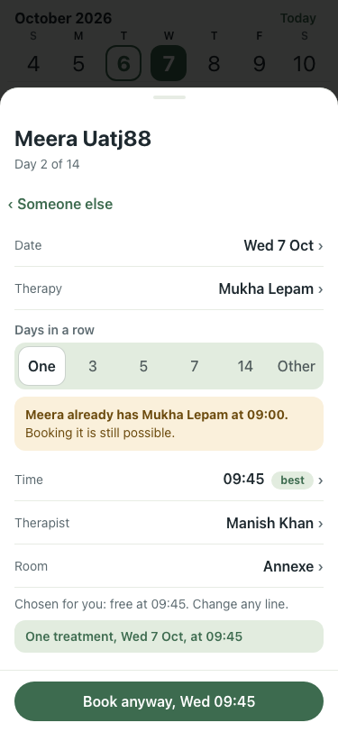 |
| 05 | A different therapy, booked: the day now has 2 | pass | Booked Meera Uatj88 Snehapana at 09:45. Meera has 2 that day. Add another Done Undo Close | 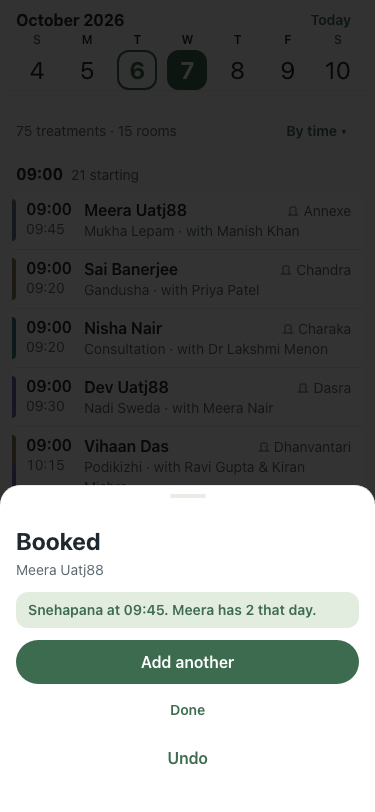 |
| 06 | Over the limit: Dev already has 4 tomorrow; the fifth shows the warning and Book anyway | pass | Dev Uatj88 Day 2 of 14 · last: Gandusha 7 Oct ‹ Someone else Date Wed 7 Oct › Therapy Mukha Lepam › Days in a row One 3 5 7 14 Other Dev already has 4 treatment | 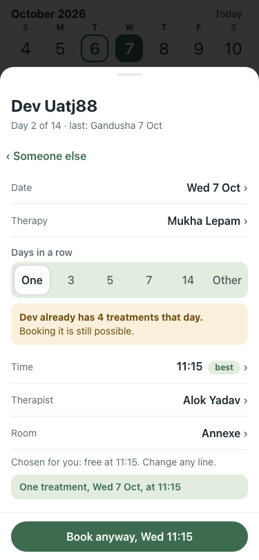 |
| 07 | Book anyway: it books, and the panel says Dev has 5 | pass | Booked Dev Uatj88 Mukha Lepam at 11:15. Dev has 5 that day. Add another Done Undo Close | 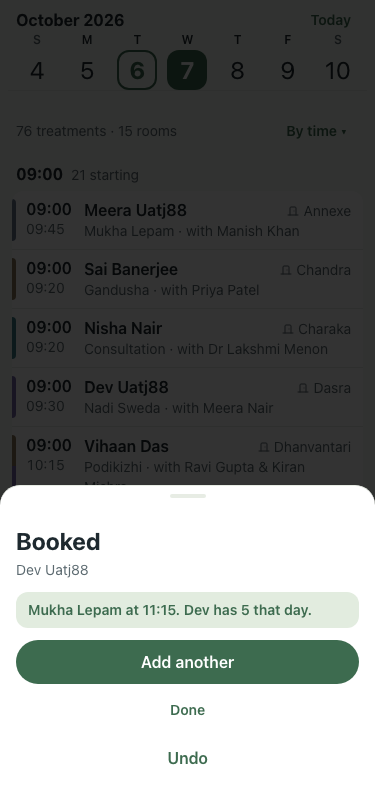 |
| 08 | Dead end, not staying: the stay is named, with a day to go to and Change their stay | pass | Meera Uatj88 Day 2 of 14 · last: Snehapana 7 Oct ‹ Someone else Date Sun 15 Nov › Therapy Mukha Lepam › Days in a row One 3 5 7 14 Other Their stay runs Tue 6 O | 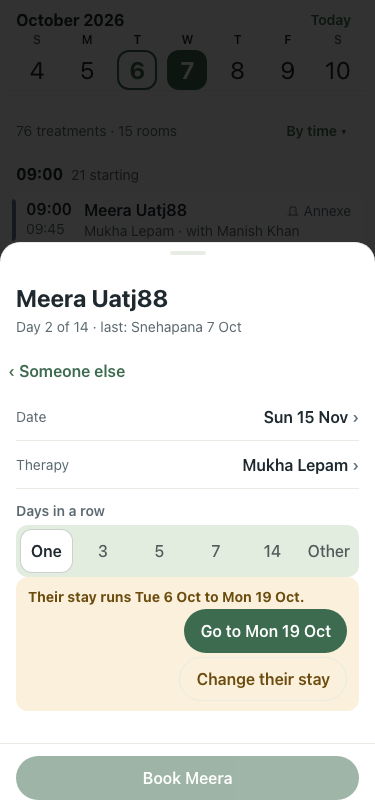 |
| 09 | Change their stay: one tap opens the stay sheet over the booking, Leaving already on that day (#343) | pass | Stay for Meera Now Tue 6 Oct to Mon 19 Oct · 14 days Arrived Tue 6 Oct › Leaving Sun 15 Nov › Leaves today 27 days longer. Meals carry on to Sun 15 Nov. Stay un | 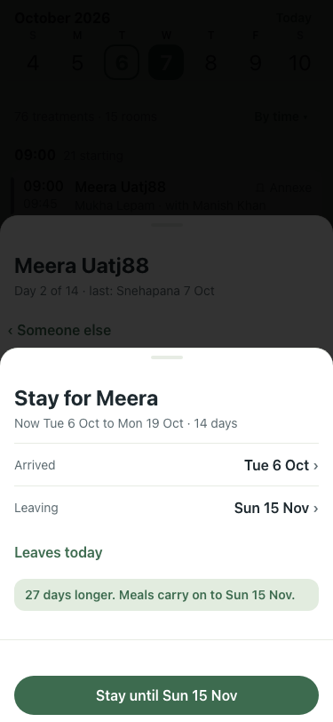 |
| 10 | Saved as offered: back on the booking, that day now bookable | pass | Meera Uatj88 Day 2 of 41 · last: Snehapana 7 Oct ‹ Someone else Date Sun 15 Nov › Therapy Mukha Lepam › Days in a row One 3 5 7 14 Other Time 09:00best › 09:00  | 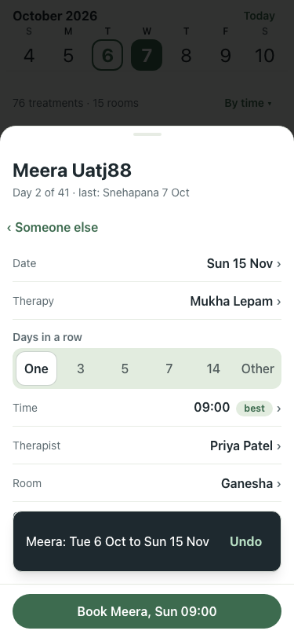 |
| 11 | Dead end, no free time: the next free day is one tap | pass | Meera Uatj88 Day 2 of 41 · last: Snehapana 7 Oct ‹ Someone else Date Wed 7 Oct › Therapy Uat Longday j88 › Days in a row One 3 5 7 14 Other No free time for Mee | 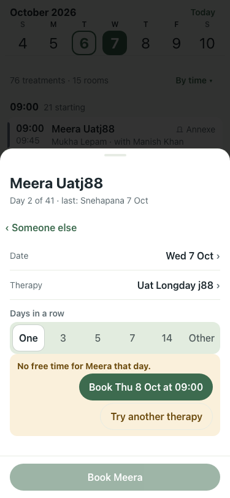 |
| 12 | Dead end, today's hours are over: Book tomorrow | FAIL | Meera Uatj88 Day 1 of 41 · last: Snehapana 7 Oct ‹ Someone else Date Tue 6 Oct › Therapy Mukha Lepam › Days in a row One 3 5 7 14 Other Time 09:00best › 09:00 · | 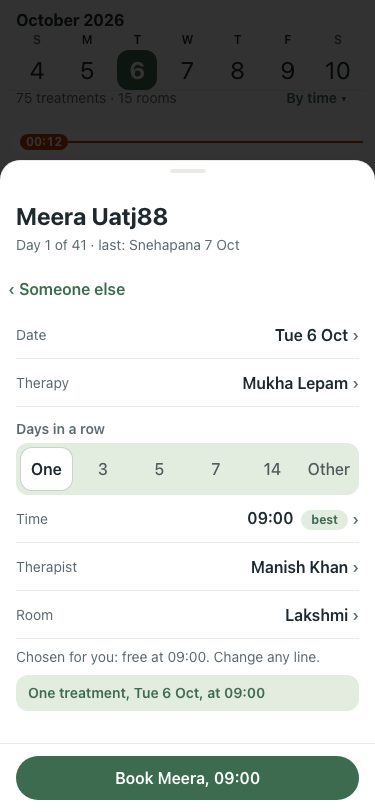 |
| 13 | Dead end, not enough therapists of her gender: add one, or allow any gender | pass | Meera Uatj88 Day 2 of 41 · last: Snehapana 7 Oct ‹ Someone else Date Wed 7 Oct › Therapy Uat Vamana j88 › Days in a row One 3 5 7 14 Other Uat Vamana j88 needs  | 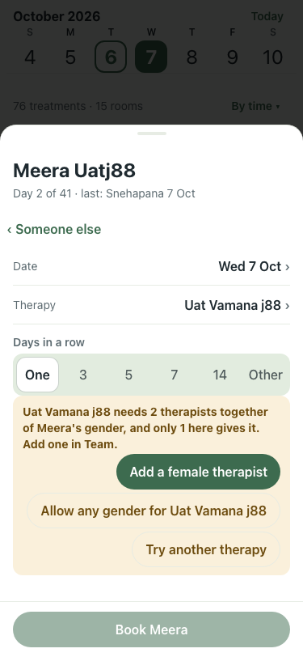 |
| 14 | Add a female therapist opens the form with Female and the therapy filled in | pass | Add therapist or doctor Name, role and gender are needed. The rest can wait. Name Role Therapist Doctor Gender Used when a therapy needs a therapist of the pati | 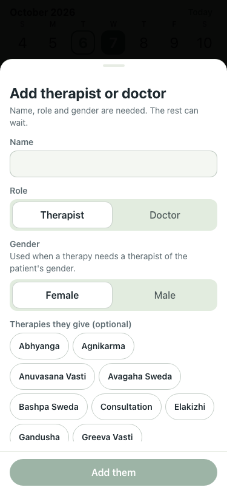 |
| 15 | Allow any gender: a time appears | pass | Meera Uatj88 Day 2 of 41 · last: Snehapana 7 Oct ‹ Someone else Date Wed 7 Oct › Therapy Uat Vamana j88 › Days in a row One 3 5 7 14 Other Time 10:15best › 10:1 | 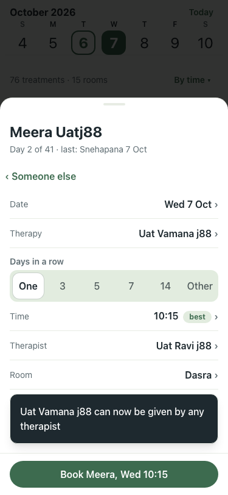 |
| 16 | New patient inline: nobody matches, so the name is offered as a new patient | pass | Book a treatment Who is it for? NO ONE FOUND Add “Zed Uatj88” as a new patient + Close | 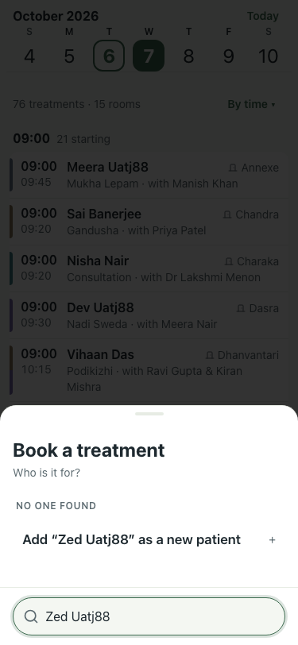 |
| 17 | The short form has the name filled in and no consultation to choose | pass | New patient Only name and gender are needed. Everything else can wait. Name ✓ Gender Female Male Other Arriving Wed 7 Oct Leaving Tue 20 Oct Stays on site Off f | 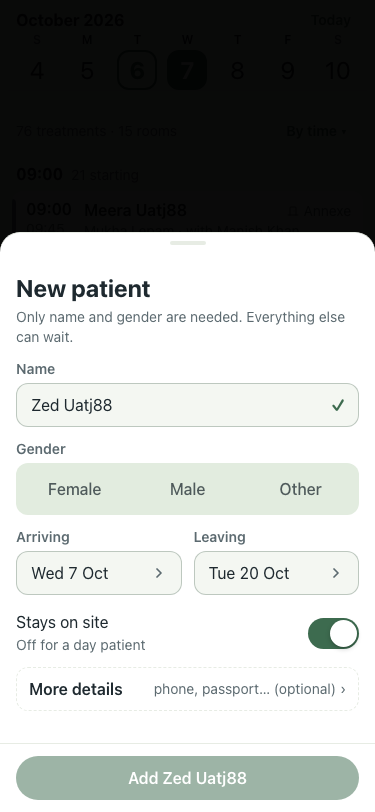 |
| 18 | Add: back on the booking with Zed chosen and the therapy list | pass | Zed Uatj88 Day 1 of 14 ‹ Someone else Date Wed 7 Oct › Choose a therapy Other therapies › Choose a therapy Close | 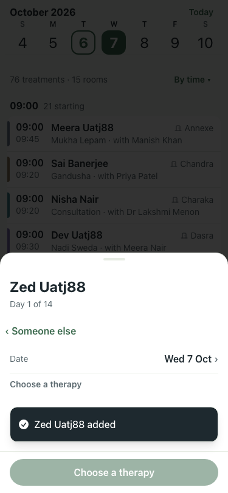 |
