# UAT booking from + (#330)

Base http://localhost:8099, 375x812. Written by scripts/uat-330.mjs; it seeds its own "Uat" people and therapies. The hours-over step needs the centre's clock past closing.

| # | Step | Result | Read off the page | Shot |
|---|---|---|---|---|
| 01 | Open + and choose Meera: no therapy is chosen, the list shows facts, Book says Choose a therapy | pass | Meera Uat75t Day 2 of 14 ‹ Someone else Date Tue 6 Oct › Choose a therapy Other therapies › Choose a therapy Close | 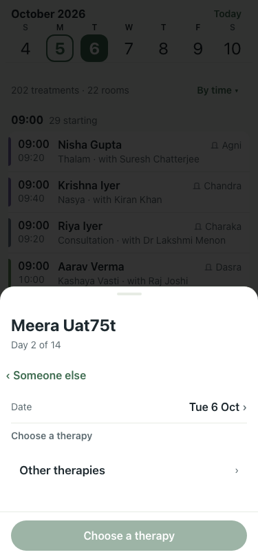 |
| 02 | Choose Snehapana: the best time, therapist and room fill in; Days in a row has chips | pass | Meera Uat75t Day 2 of 14 ‹ Someone else Date Tue 6 Oct › Therapy Snehapana › Days in a row One 3 5 7 14 Other Time 11:45best › 11:45 · best 12:00 12:15 12:30 12 | 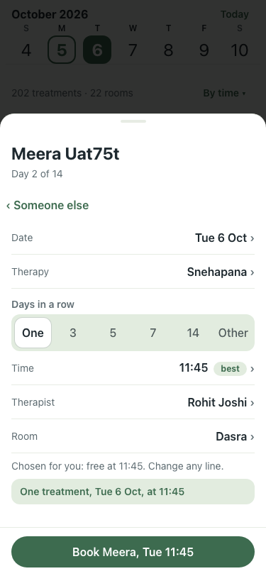 |
| 03 | Book: the sheet stays on Booked with Add another and Done, the toast keeps Undo | pass | Booked Meera Uat75t Snehapana at 11:45. Meera has 1 that day. Add another Done Close | toast: Booked Meera: Snehapana at 11:45 Undo | 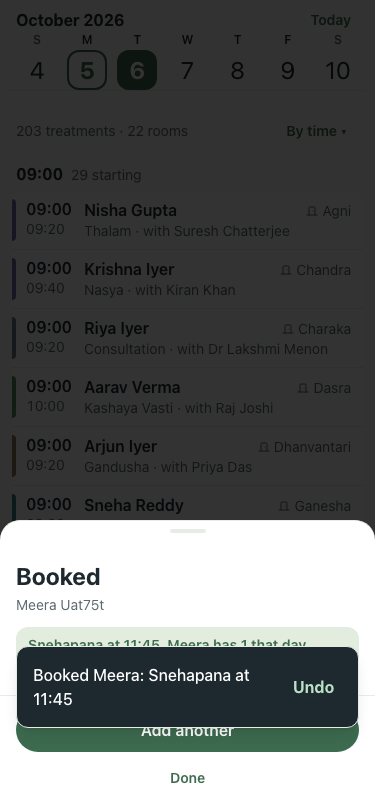 |
| 04 | Add another: the same patient, no therapy chosen; Snehapana is greyed "already at"; choosing it warns | pass | Meera Uat75t Day 2 of 14 ‹ Someone else Date Tue 6 Oct › Choose a therapy Snehapana already at 11:45 Other therapies › Choose a therapy Close || Meera Uat75t Day 2 of 14 ‹ Someone else Date Tue 6 Oct › Therapy Snehapana › Days in a row One 3 5 7 14 Other Meera already has Snehapana at 11:45. Booking it i | 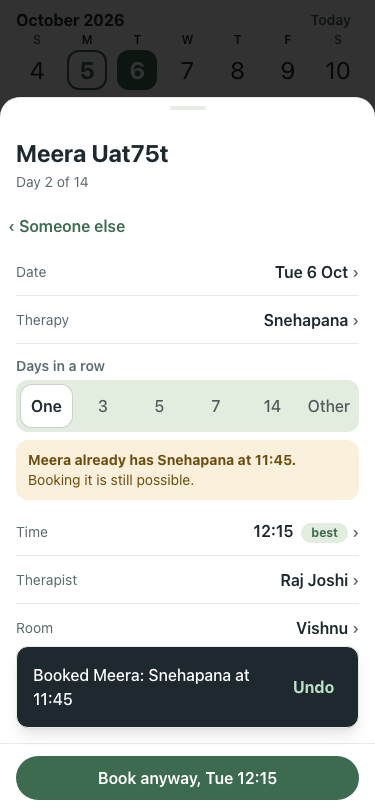 |
| 05 | A different therapy, booked: the day now has 2 | pass | Booked Meera Uat75t Nasya at 12:15. Meera has 2 that day. Add another Done Close | 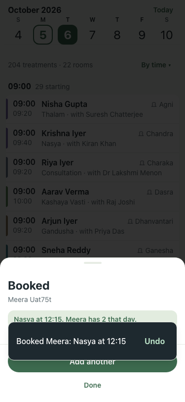 |
| 06 | Over the limit: Dev already has 4 tomorrow; the fifth shows the warning and Book anyway | pass | Dev Uat75t Day 2 of 14 · last: Padabhyanga 6 Oct ‹ Someone else Date Tue 6 Oct › Therapy Snehapana › Days in a row One 3 5 7 14 Other Dev already has 4 treatmen | 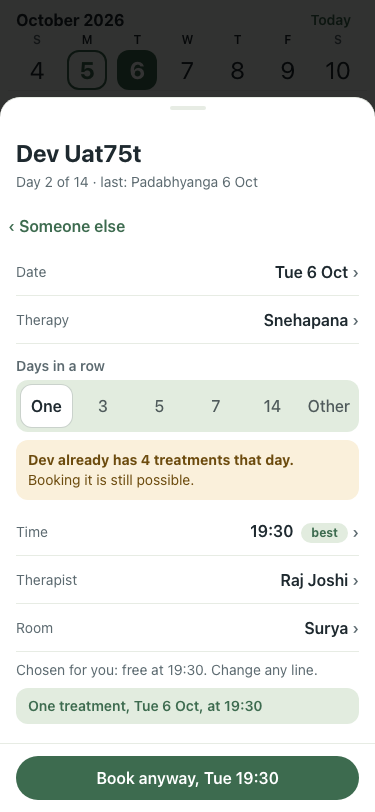 |
| 07 | Book anyway: it books, and the panel says Dev has 5 | pass | Booked Dev Uat75t Snehapana at 19:30. Dev has 5 that day. Add another Done Close | 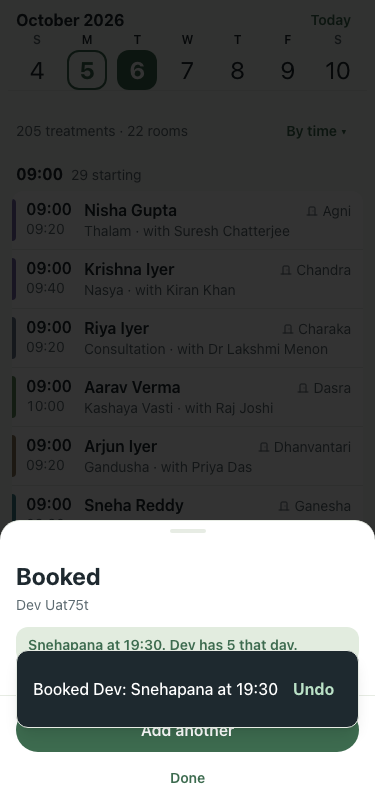 |
| 08 | Dead end, not staying: the stay is named, with a day to go to and Change their stay | pass | Meera Uat75t Day 2 of 14 · last: Nasya 6 Oct ‹ Someone else Date Sat 14 Nov › Therapy Snehapana › Days in a row One 3 5 7 14 Other Their stay runs Mon 5 Oct to  | 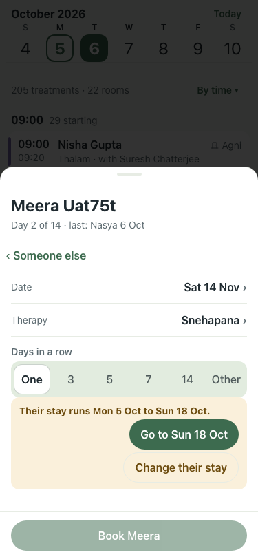 |
| 09 | Dead end, no free time: the next free day is one tap | pass | Meera Uat75t Day 2 of 14 · last: Nasya 6 Oct ‹ Someone else Date Tue 6 Oct › Therapy Uat Longday 75t › Days in a row One 3 5 7 14 Other No free time for Meera t | 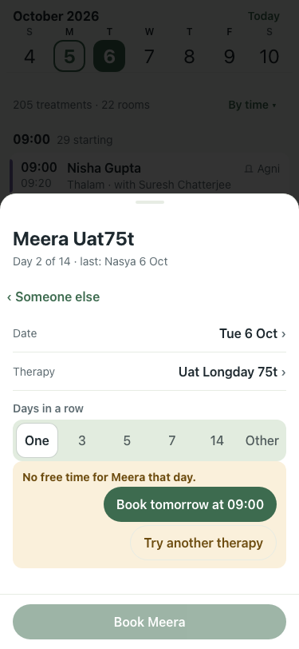 |
| 10 | Dead end, today's hours are over: Book tomorrow | pass | Meera Uat75t Day 1 of 14 · last: Nasya 6 Oct ‹ Someone else Date Mon 5 Oct › Therapy Snehapana › Days in a row One 3 5 7 14 Other Today's hours are over. Book t | 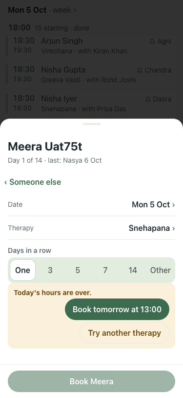 |
| 11 | Dead end, not enough therapists of her gender: add one, or allow any gender | pass | Meera Uat75t Day 2 of 14 · last: Nasya 6 Oct ‹ Someone else Date Tue 6 Oct › Therapy Uat Vamana 75t › Days in a row One 3 5 7 14 Other Uat Vamana 75t needs 2 th | 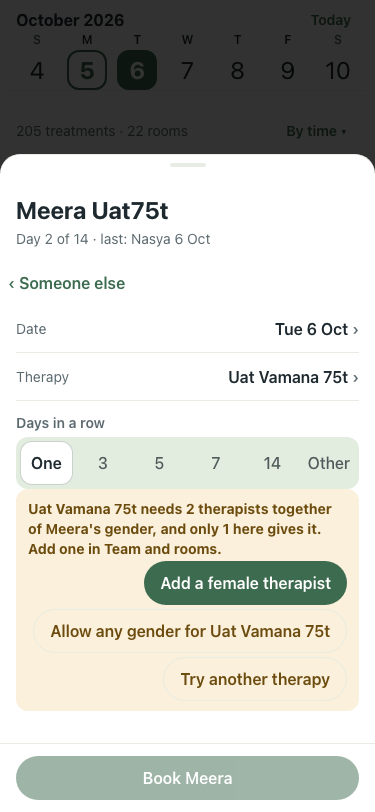 |
| 12 | Add a female therapist opens the form with Female and the therapy filled in | pass | Add therapist or doctor Name, role and gender are needed. The rest can wait. Name Role Therapist Doctor Gender Used when a therapy needs a therapist of the pati | 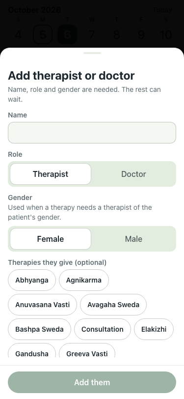 |
| 13 | Allow any gender: a time appears | pass | Meera Uat75t Day 2 of 14 · last: Nasya 6 Oct ‹ Someone else Date Tue 6 Oct › Therapy Uat Vamana 75t › Days in a row One 3 5 7 14 Other Time 09:45best › 09:45 ·  | 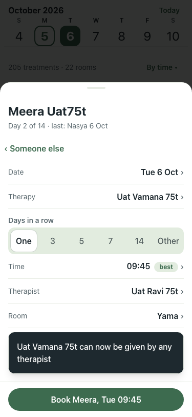 |
| 14 | New patient inline: nobody matches, so the name is offered as a new patient | pass | Book a treatment Who is it for? NO ONE FOUND Add “Zed Uat” as a new patient + Close | 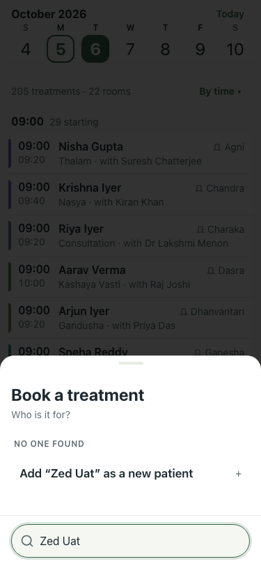 |
| 15 | The short form has the name filled in and no consultation to choose | pass | New patient Only name and gender are needed. Everything else can wait. Name ✓ Gender Female Male Other Arriving Tue 6 Oct Leaving Mon 19 Oct Stays on site Off f | 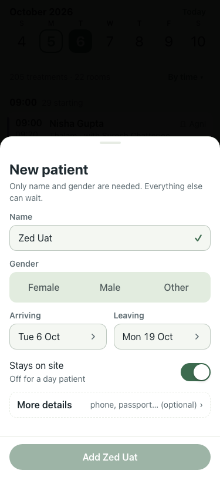 |
| 16 | Add: back on the booking with Zed chosen and the therapy list | pass | Zed Uat Day 1 of 14 ‹ Someone else Date Tue 6 Oct › Choose a therapy Other therapies › Choose a therapy Close | 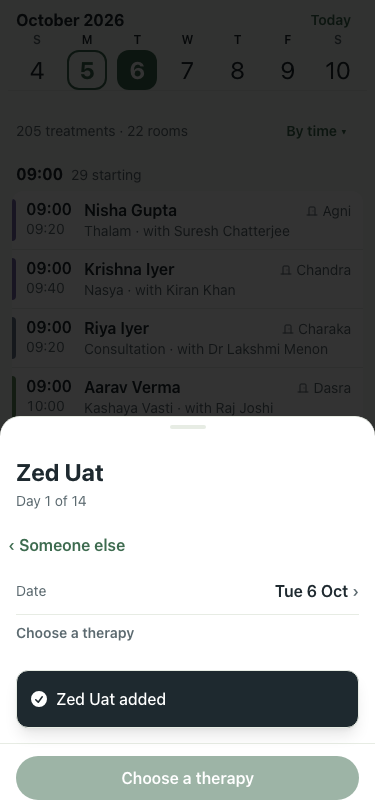 |
