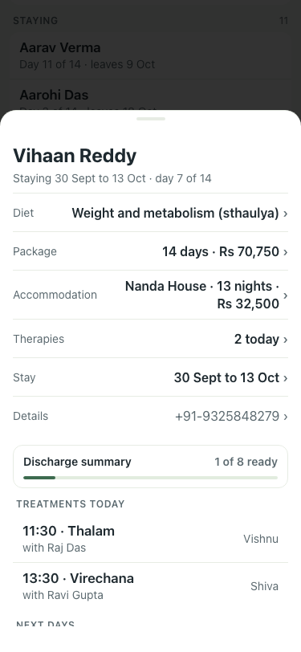
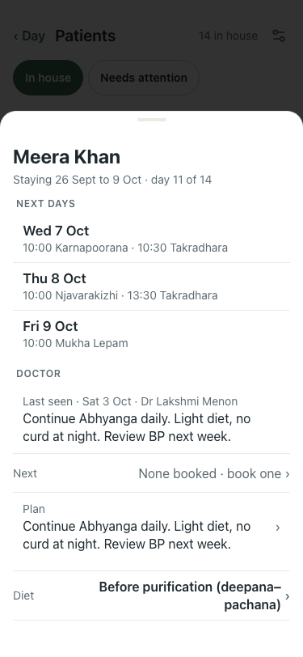
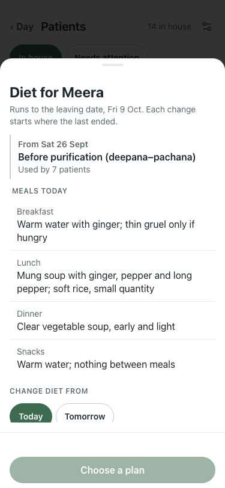

# #353 card order — UAT at 375×812, lite seed

| Step | Result | Shot |
|---|---|---|
| Before: card opens on the change lines; Next days below the fold | (main) |  |
| After: mid-stay patient (day 11 of 14) shows Next days and the doctor's last note without scrolling | pass |  |
| After: change lines, discharge bar, today's treatments follow; no "Therapies · N today" line | pass |  |
| After: Diet sheet holds Meals today | pass |  |

Taps: meals today 2 → 3; the five card change-line jobs keep their taps but now need one scroll. Accepted: the card leads with the week (decided 6 Oct).
