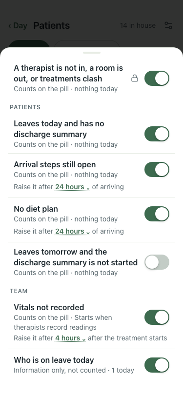

# Demo reset puts "What needs you" rules back (#389), 375×812, lite seed

Each run: change two rules by API (arrival steps after 1 hour, leaves-tomorrow on), `POST /settings/reset-demo-data`, open Patients → What needs you.

| # | Check | Result | Shot |
|---|---|---|---|
| 01 | Before (:8201, main): after reset, "Raise it after 1 hours" and "Leaves tomorrow … Changed from off" survive; 7 of 7 on | baseline |  |
| 02 | After (this branch): reset brings back 24 hours and leaves-tomorrow off; nothing marked changed | pass |  |
