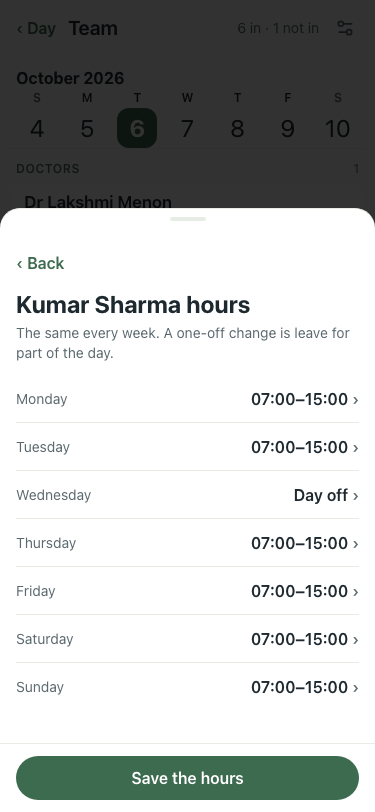
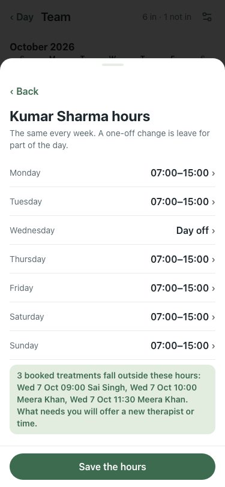
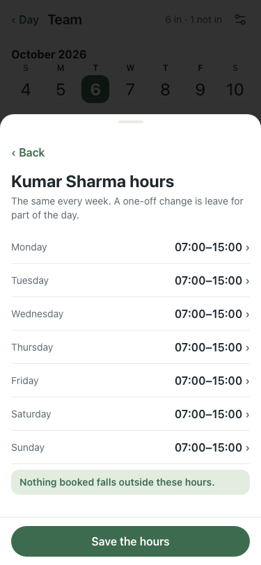

# Hours page consequence line (#380), 375×812, lite seed

Kumar Sharma (early 07:00–15:00 every day) → Details and therapies → Hours.

| # | Check | Result | Shot |
|---|---|---|---|
| 01 | Before: Wednesday set to Day off, nothing says what it does to his bookings | baseline |  |
| 02 | After: "3 booked treatments fall outside these hours: Wed 7 Oct 09:00 Sai Singh, Wed 7 Oct 10:00 Meera Khan, Wed 7 Oct 11:30 Meera Khan. What needs you will offer a new therapist or time." | pass |  |
| 03 | After: a change that leaves his hours as they were reads "Nothing booked falls outside these hours." | pass |  |

Server: `POST /staff/:id/hours-check` uses the guard's own `hoursOn` (via `outsideHours`, tested in `offHours.test.ts`); without a token it returns 401. qa 39/39, smoke 6/6.
