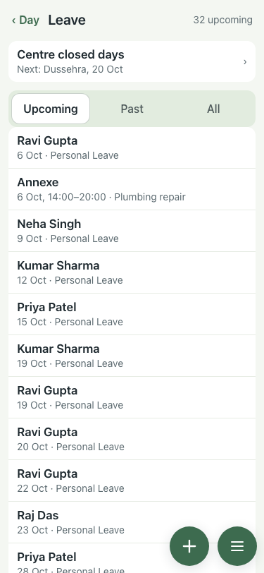
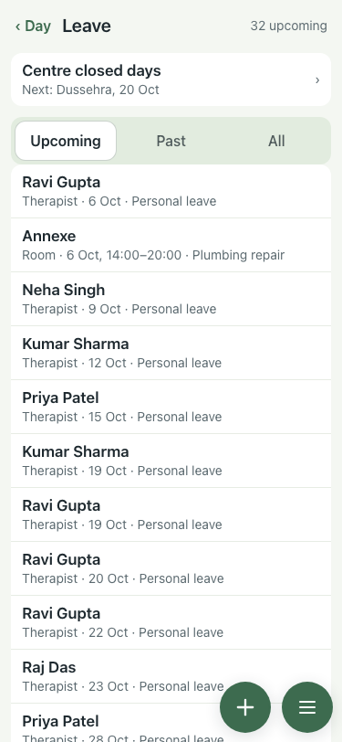

# Leave list kinds (#360), 375×812, lite seed

| # | Check | Result | Shot |
|---|---|---|---|
| 01 | Before: "Annexe · 6 Oct, 14:00–20:00 · Plumbing repair" reads like a person; reasons "Personal Leave" | baseline |  |
| 02 | After: every row starts with its kind ("Therapist ·", "Room ·"); seeded reasons read "Personal leave" | pass |  |

Day sheet and rota (pdftotext, 6 Oct): neither prints a leave reason, so both are unchanged.
