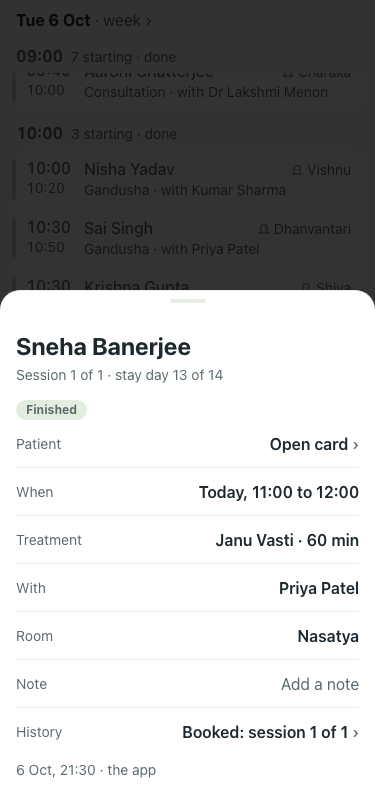
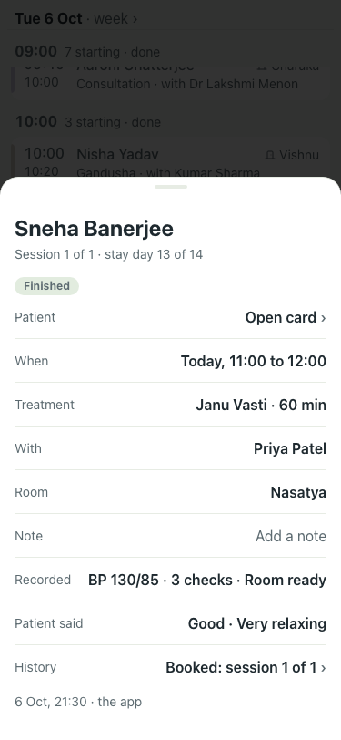
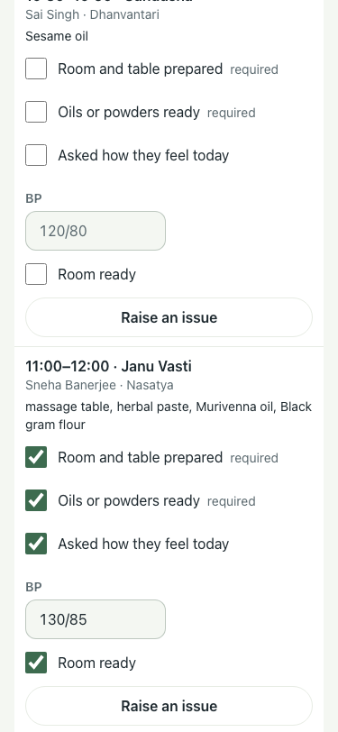

# Link records on the treatment card (#219, link views), 375×812, lite seed

Set-up: Priya Patel's link ticked the three checks on Sneha Banerjee's 11:00 Janu Vasti, wrote BP 130/85 and Room ready; Sneha's own link gave it "Good · Very relaxing".

| # | Check | Result | Shot |
|---|---|---|---|
| 01 | Before: the admin's card for that treatment shows none of it | baseline |  |
| 02 | After: "Recorded · BP 130/85 · 3 checks · Room ready" and "Patient said · Good · Very relaxing", read only | pass |  |
| 03 | The therapist's link page that wrote it (ticks and BP kept) | pass |  |

Not printed: the day sheet is unchanged (records are never printed, per #219). Smoke 6/6.
