# UAT 2026-10-06-new-trial

Base http://localhost:8390, 375x812. Written by scripts/uat.mjs.

| # | Step | Result | Read off the page | Shot |
|---|---|---|---|---|
| 06 | Book a treatment from the day: + → who → Abhyanga → Book | FAIL | button "Book Rekha, Wed 09:00"; toast ""; 1 on tomorrow's sheet | 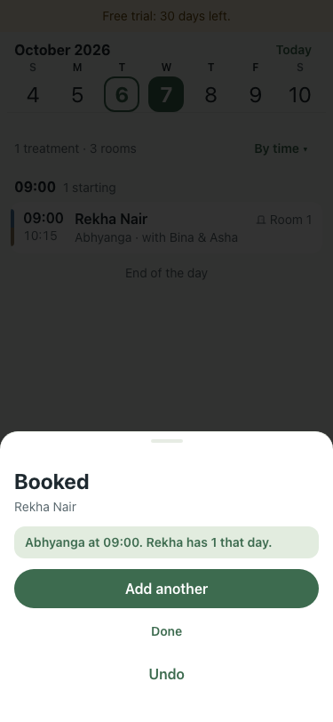 |
| 07 | A course: Abhyanga, 3 sessions one a day | FAIL | TimeoutError: locator.selectOption: Timeout 30000ms exceeded. Call log:   - waiting for getByRole('dialog').last().getByLabel('Sessions', { exact: true }) | 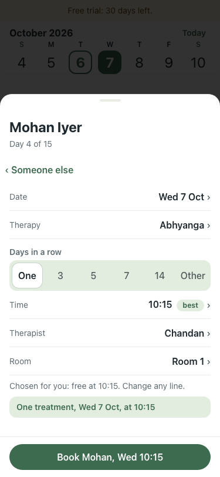 |
| 08 | Print tomorrow's sheets: Menu → Print downloads a PDF with the names on it | pass | PDF                                                   Walk Seven — Wednesday, 07 October 2026 |   Patient                                                                   09:00 | No diet plan — 6 patient | 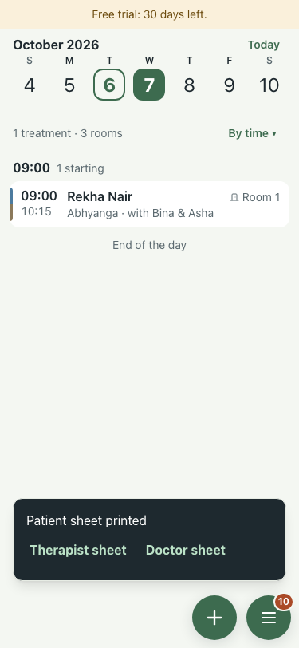 |
| 09 | Leave: Menu → Leave → + → Asha, tomorrow, Save plan later; the pill then names who is stranded | pass | Bina off; toast "Leave saved. The day still needs planning: it waits under "need you"."; menu: Menu | 11 need you | Things to fix or decide | › | 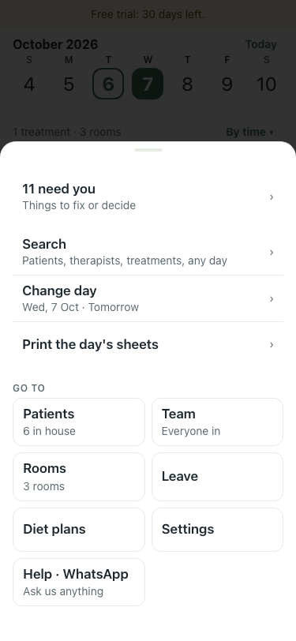 |
| 10 | Fix from the pill: the day clears, then Undo puts it back | FAIL | TimeoutError: locator.click: Timeout 5000ms exceeded. Call log:   - waiting for getByRole('dialog').last().locator('[data-main]').first() | 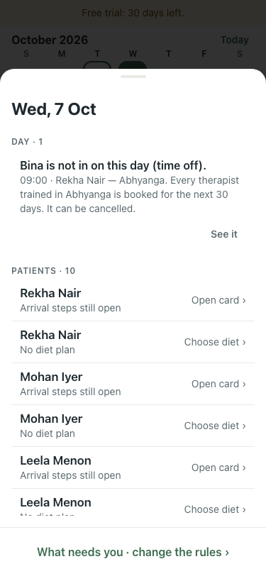 |
| 11 | No-show: Rekha didn't come, from the treatment card; Undo follows | pass | statuses no_show; toast "Rekha: didn't come. Room and therapist are free. Undo" | 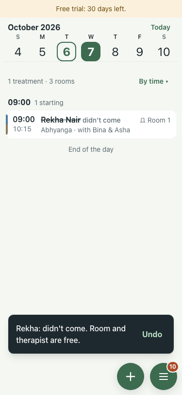 |
| 12 | Cancellation: Mohan wants to cancel one day of the course | FAIL | TimeoutError: locator.click: Timeout 5000ms exceeded. Call log:   - waiting for getByText('Mohan Iyer', { exact: true }).first() | 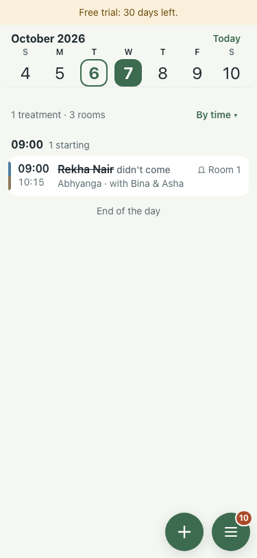 |
| 13 | Doctor consultation: Leela booked from + with Therapy set to Consultation | FAIL | button "Book Leela, Wed 09:00"; toast "" | 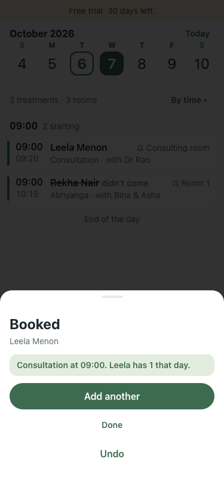 |
| 14 | Private links: Asha's from Team, Dr Rao's and Rekha's by API; each opens its own day with no sign-in | FAIL | Asha: Free trial: 30 days left. / Asha / Walk Seven / ‹ || Dr Rao: Free trial: 30 days left. / Dr Rao / Walk Seven / ‹ || Rekha: Free trial: 30 days left. / Rekha Nair / Walk Seven / ‹ | 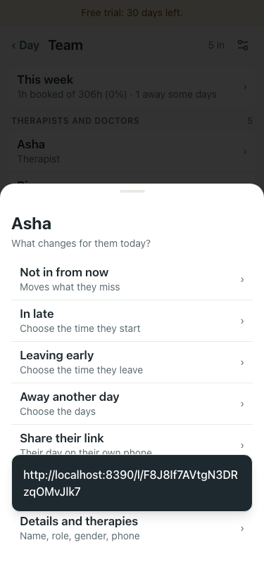 |
| 15 | Discharge summary: Rekha's card shows 0 of 8 ready, and Print summary still prints | pass | Discharge summary · Rekha | 0 of 8 ready. It prints either way. | STILL MISSING; printed: downloaded;                                                                      Walk Seven |                                                              Discharge Summary | 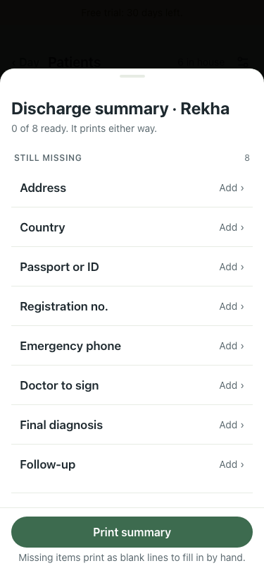 |
| 16 | Move to another install: Settings → Backups → Download everything, then Load a centre on a fresh install; the same day sheet prints | FAIL | TypeError: fetch failed | 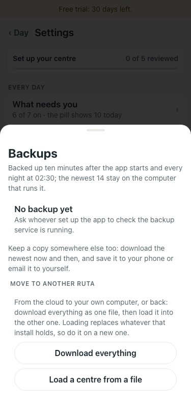 |
| 17 | Trial state 5 days in: the banner and what + does | pass | banner "Free trial: 25 days left."; API write 201; tapping +: "Book a treatment" | 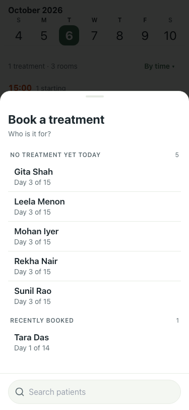 |
| 18 | Trial state 26 days in: the banner and what + does | FAIL | banner "GET STARTED"; API write 429; tapping +: "Book a treatment" | 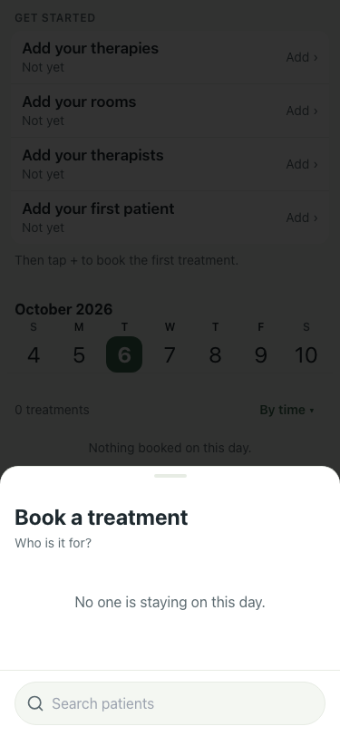 |
| 19 | Trial state 29 days in: the banner and what + does | FAIL | banner "GET STARTED"; API write 429; tapping +: "Book a treatment" |  |
| 20 | Trial state 31 days in: the banner and what + does | pass | banner "GET STARTED"; API write 429; tapping +: "Book a treatment" |  |

Wizard (w1–w4): the sign-in link opens on the password step; three steps; Finish lands on Get started. Pass.

## Read honestly

Steps marked FAIL that are the walk script, not the app: 06 and 13 booked (the sheet now stays on "Booked" and the toast comes on close, #330); 07, 10 and 12 use controls that changed (Sessions, the fix button); 14's three links open their own day; 16 needs a second install; 18–20 hit the trial centre's default write limit (429). The script's therapy taps and container name are fixed in this PR; the rest is left for the next walk.

## Found

| Finding | Issue |
|---|---|
| The inbox blames a full diary when Abhyanga needs two therapists and only one is in | #368 |
| A treatment under way with an absent therapist shows no flag (whole-app walk, 14:52) | #367 |
| The demo's therapist-off problem is gone by the afternoon | #369 |
| Date comma, leave hint spacing, a patient listed twice, Not planned row order | #370 |
