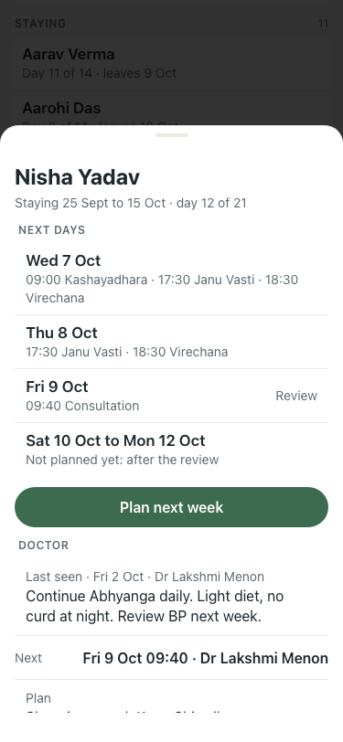
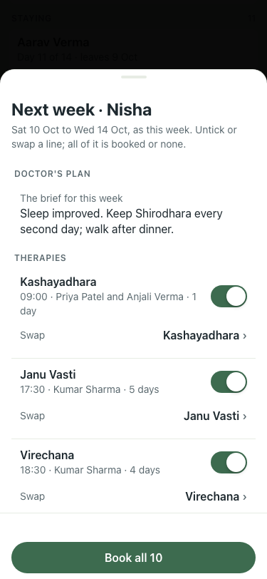
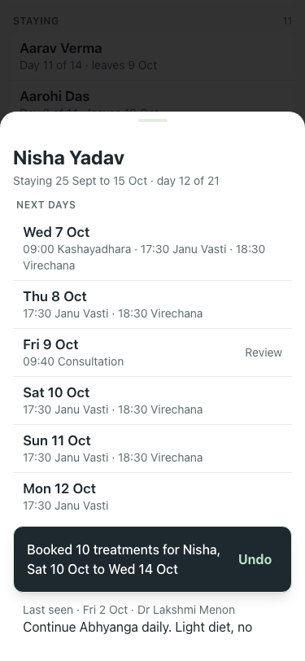

# #354 Plan next week — UAT at 375×812, lite seed

| Step | Result | Shot |
|---|---|---|
| Card: Plan next week under Next days, the review and "Not planned yet" above it | pass |  |
| Sheet: doctor's plan as the brief, each therapy ticked with time, therapist and days, Swap under it; a line with no free time starts unticked and says why | pass |  |
| Book all: toast "Booked 10 treatments … Undo"; the card's Next days fill in | pass |  |
| A line that cannot be placed, left ticked: nothing booked, the toast names the therapy and day | pass (first run, before the default untick) | — |
| Undo on the toast can be tapped while the card is open (it could not, app-wide, before this PR) | pass | — |
| Day sheet for Sun 11 Oct (pdftotext) lists the newly booked treatments with therapist and room | pass | — |

Taps (tapCount): story 14, card → Plan next week → Book all = 3 (+1 scroll to reach the patient), was 10.
