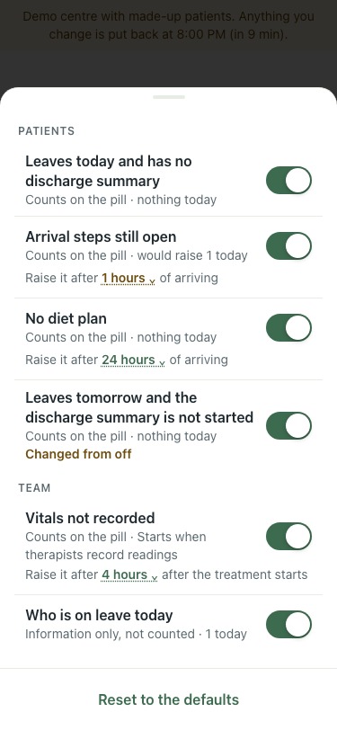
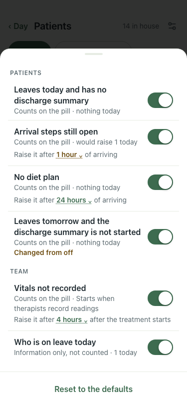

# Rules sheet: "1 hour" (#391), 375×812, lite seed

Arrival steps rule set to 1 hour by API, then Patients → What needs you.

| # | Check | Result | Shot |
|---|---|---|---|
| 01 | Before: "Raise it after 1 hours" | baseline |  |
| 02 | After: "Raise it after 1 hour"; 4/12/24/48 still read "hours" | pass |  |
