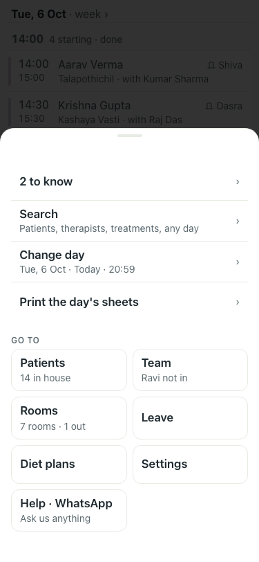
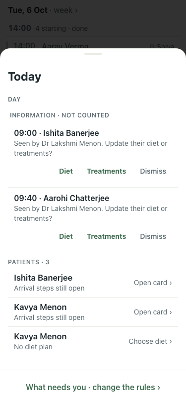
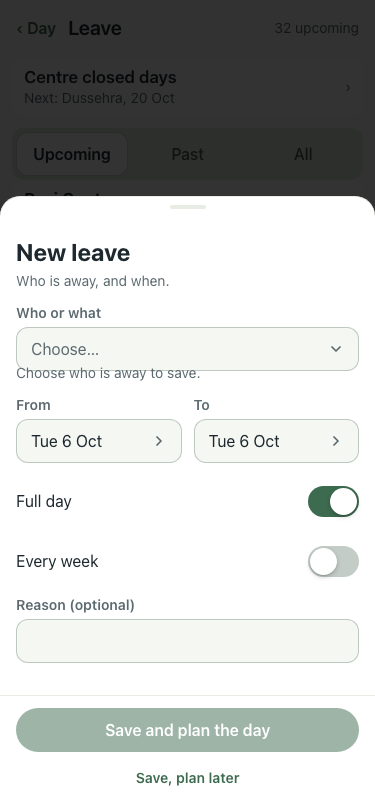
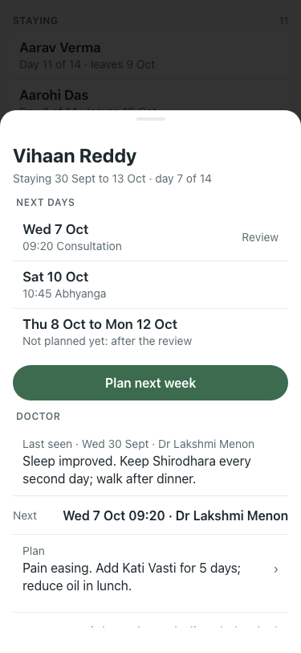
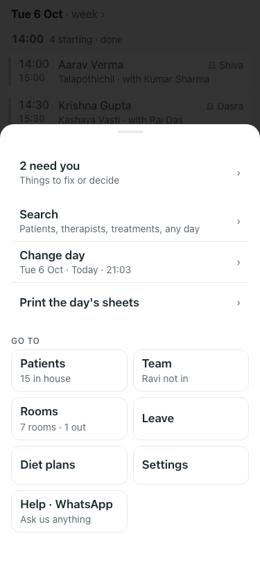
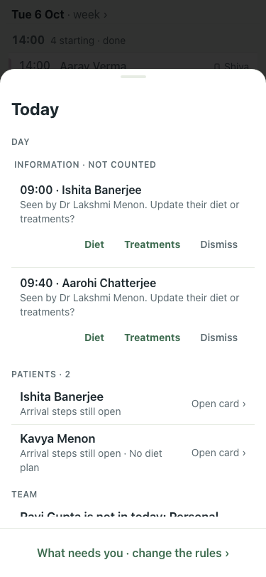
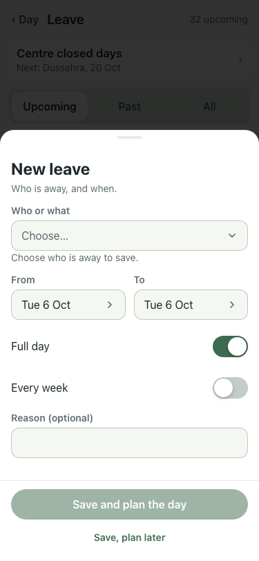
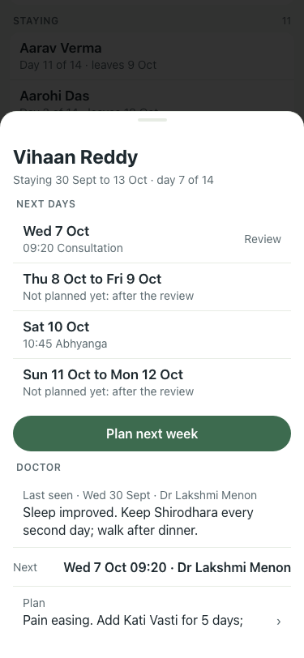

# 6 Oct polish (#370), 375×812, lite seed

Set-up for the shots: Vihaan Reddy booked on Sat 10 Oct (after his review), a new patient Kavya Menon arriving today with no diet, and the two arrival rules set to 1 hour so the evening inbox shows them. Rules put back before the smoke run.

| # | Check | Result | Shot |
|---|---|---|---|
| 02 | Before: Menu reads "Tue, 6 Oct · Today" | baseline |  |
| 03 | Before: Kavya Menon listed twice under Patients | baseline |  |
| 04 | Before: "Choose who is away to save." touches the Who field | baseline |  |
| 05 | Before: "Thu 8 Oct to Mon 12 Oct · Not planned yet" sits after Sat 10 Oct | baseline |  |
| 06 | After: strip and Menu read "Tue 6 Oct" | pass |  |
| 07 | After: one row "Kavya Menon · Arrival steps still open · No diet plan", Open card; Patients · 2 | pass |  |
| 08 | After: the hint sits clear under the field | pass |  |
| 09 | After: Wed 7 · Thu 8–Fri 9 not planned · Sat 10 Abhyanga · Sun 11–Mon 12 not planned, in order | pass |  |
