# UAT 2026-10-06-walk

Base http://localhost:8400, 375x812. Written by scripts/uat.mjs.

| # | Step | Result | Read off the page | Shot |
|---|---|---|---|---|
| 01 | Get started on a new trial: four rows and a plain next step | pass | GET STARTED | Add your therapies | Not yet | Add › | Add your rooms | Not yet | Add › | Add your therapists | Not yet | Add › | Add your first patient | Not yet | 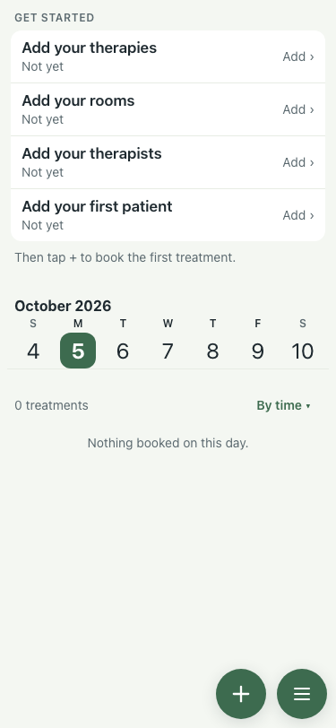 |
| 02 | Therapies from the library: tick three, add them | pass | 3 therapies now | 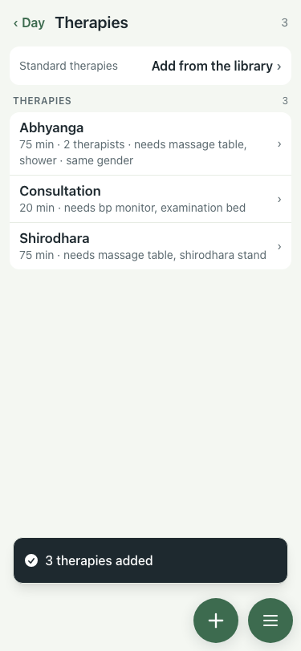 |
| 03 | Rooms: the form, then rooms made with the fittings the therapies need | pass | 3 rooms; form: Add room | Give it a name and tick what it has. | Name | What it has | A therapy that needs something is only booked into a room that has it. | bp monitor | examination bed | massage table | 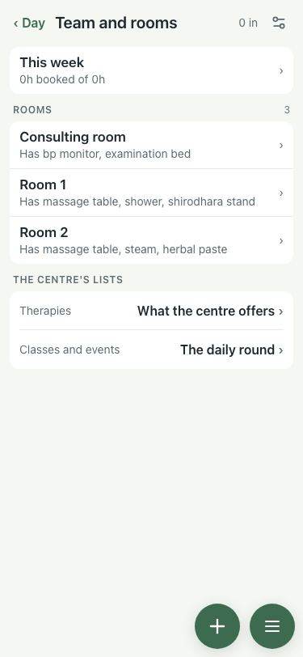 |
| 04 | Therapists: Asha added on the form, a doctor and two more by API | pass | 5 on the team; form: Add therapist or doctor | Name, role and gender are needed. The rest can wait. | Name | Role | Therapist | Doctor | Gender | Used when a therapy needs a therapist of the patient's gender. | 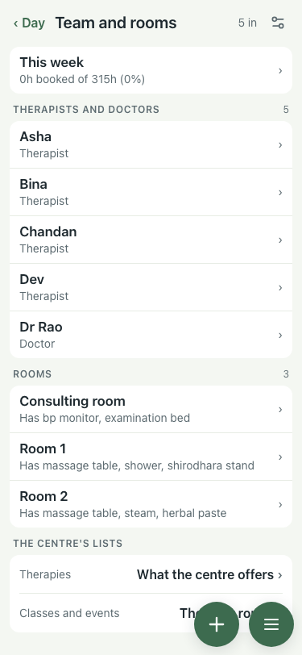 |
| 05 | Patients: + New patient, name and gender, lands on the card; five more by API with stays | pass | 6 patients; Tara has 1 booking (the consultation); form: New patient | Only name and gender are needed. Everything else can wait. | Name | ✓ | Gender | Female | Male | 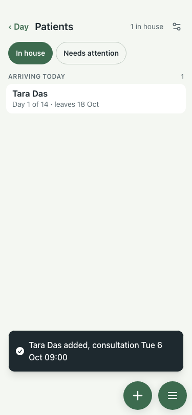 |
| 06 | Book a treatment from the day: + → who → Abhyanga → Book | pass | button "Book Rekha, Tue 09:00"; toast "Booked Rekha: Abhyanga at 09:00 Undo"; 2 on tomorrow's sheet | 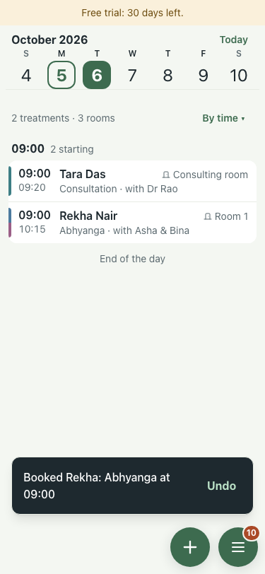 |
| 07 | A course: Abhyanga, 3 sessions one a day | pass | button "Book Mohan, 3 days from Tue 10:15"; toast "Booked Mohan: 3 × Abhyanga at 10:15 Undo"; days 2026-10-06 00:00, 2026-10-07 00:00, 2026-10-08 00:00 |  |
| 08 | Print tomorrow's sheets: Menu → Print downloads a PDF with the names on it | pass | PDF                                                           Walk Six — Tuesday, 06 October 2026 |   Patient                                        09:00                                                   | 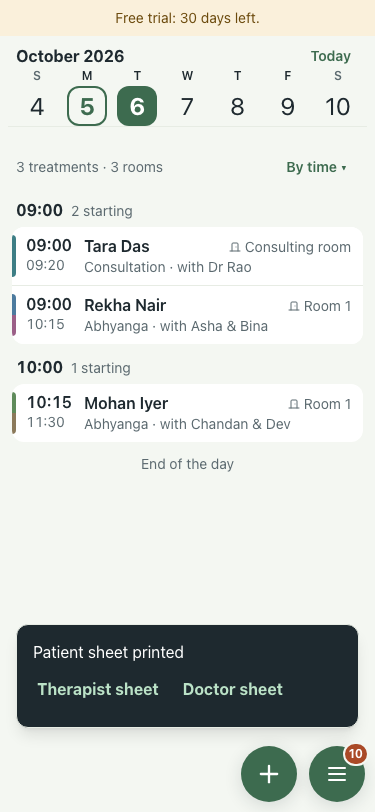 |
| 09 | Leave: Menu → Leave → + → Asha, tomorrow, Save plan later; the pill then names who is stranded | pass | Dr Rao off; toast "Leave saved. The day still needs planning: it waits under "need you"."; menu: Menu | 11 need you | Things to fix or decide | › | 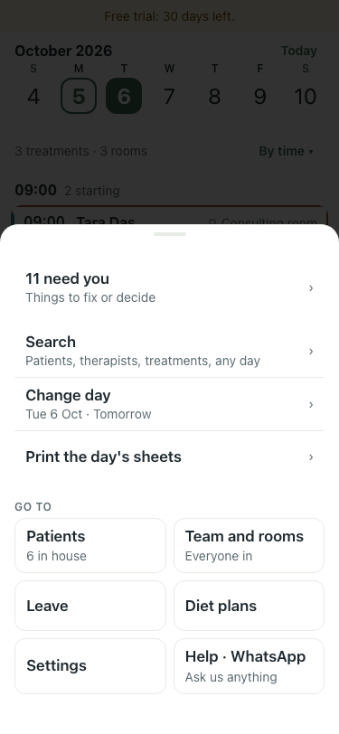 |
| 10 | Fix from the pill: the day clears, then Undo puts it back | pass | sheet: Tue 6 Oct | DAY · 1 | Dr Rao is not in on this day (time off). | 09:00 · Tara Das — Consultation | Wed 7 Oct, 09:00 with Dr Rao (1 day later) | Cancel this treatment (kept as cancelled, can be undone); moved true; undone true | 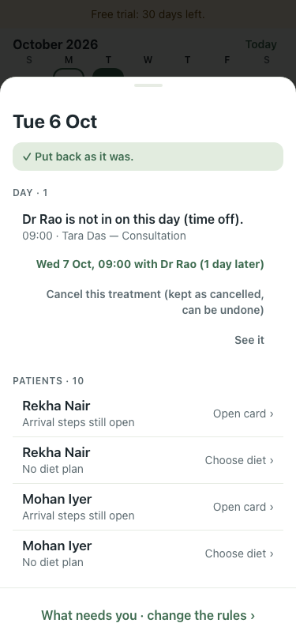 |
| 11 | No-show: Rekha didn't come, from the treatment card; Undo follows | pass | statuses no_show; toast "Rekha: didn't come. Room and therapist are free. Undo" |  |
| 12 | Cancellation: Mohan wants to cancel one day of the course | pass | statuses confirmed, confirmed, cancelled; toast "Mohan's Abhyanga cancelled Undo" | 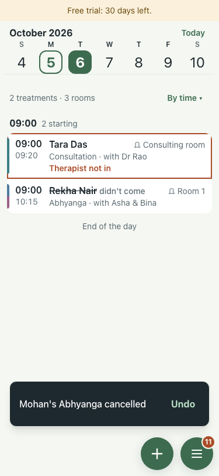 |
| 13 | Doctor consultation: Leela booked from + with Therapy set to Consultation | pass | button "Book Leela, Tue 09:30"; toast "Booked Leela: Consultation at 09:30 Undo" | 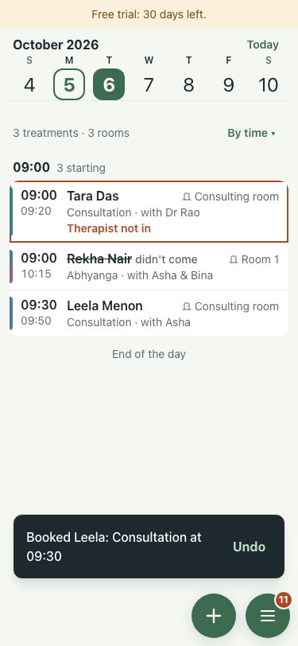 |
| 14 | Private links: Asha's from Team, Dr Rao's and Rekha's by API; each opens its own day with no sign-in | pass | Asha: Free trial: 30 days left. / Asha / Walk Six / ‹ || Dr Rao: Free trial: 30 days left. / Dr Rao / Walk Six / ‹ || Rekha: Free trial: 30 days left. / Rekha Nair / Walk Six / ‹ | 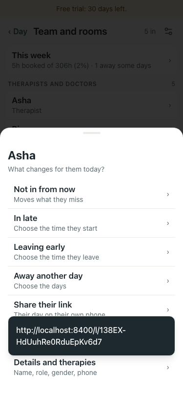 |
| 15 | Discharge summary: Rekha's card shows 0 of 8 ready, and Print summary still prints | pass | Discharge summary · Rekha | 0 of 8 ready. It prints either way. | STILL MISSING; printed: downloaded;                                                                         Walk Six |                                                                               | 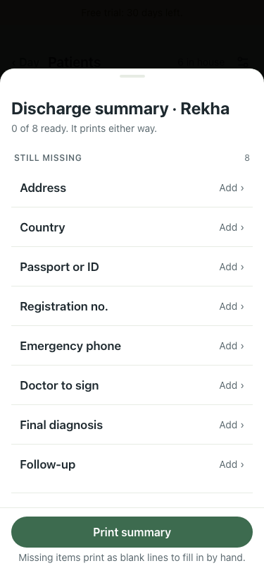 |
| 16 | Move to another install: Settings → Backups → Download everything, then Load a centre on a fresh install; the same day sheet prints | pass | signed in on the new install with the old password: true; day sheets equal: true (21 lines) | 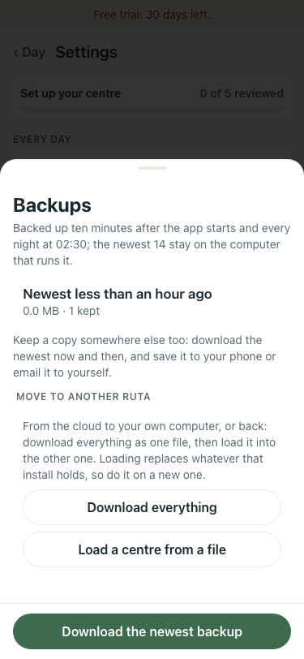 |
| 17 | Trial state 5 days in: the banner and what + does | pass | banner "Free trial: 25 days left."; API write 201; tapping +: "Book a treatment" | 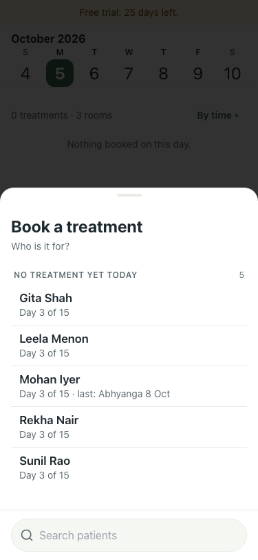 |
| 18 | Trial state 26 days in: the banner and what + does | pass | banner "Free trial: 4 days left."; API write 201; tapping +: "Book a treatment" |  |
| 19 | Trial state 29 days in: the banner and what + does | pass | banner "Free trial: 1 day left."; API write 201; tapping +: "Book a treatment" |  |
| 20 | Trial state 31 days in: the banner and what + does | pass | banner "Your free trial has ended. Nothing is deleted: download everything from Settings, or choose a plan to keep going."; API write 403; tapping +: "The free trial has ended, so nothing new can be booked. Nothing is deleted. Choose a plan" | 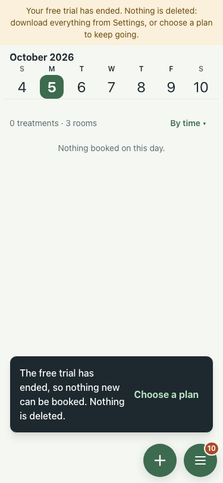 |

## Found

| Finding | Where | What was done |
|---|---|---|
| Get started said "Then open the menu and book the first treatment" although + is on the bar again | day, new centre | fixed here: "Then tap + to book the first treatment." |
| A consultation can be booked with a therapist: a therapist with nothing ticked can give every therapy, and the sheet offers them before the doctor (Asha, with Dr Rao listed "not in") | booking sheet, Therapy set to Consultation | issue opened |
| History on a treatment card shows the phone's clock, not the centre's (5 Oct 15:20 for a booking made at 18:50 centre time) | treatment card | #304, fixed next |
| Private-link pages ignore `?date=`; they open on today | link pages | harmless, left |
| Resident feedback and a therapist's tick need a treatment already given | links | not walked: needs a past day; covered by the 5 Oct walk |

Human only: the live sign-up (Cloudflare tick), real A4 print from a phone and a laptop, one day walked on a phone.
