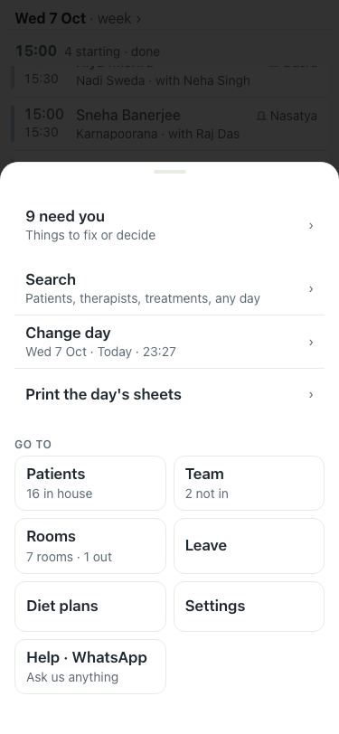
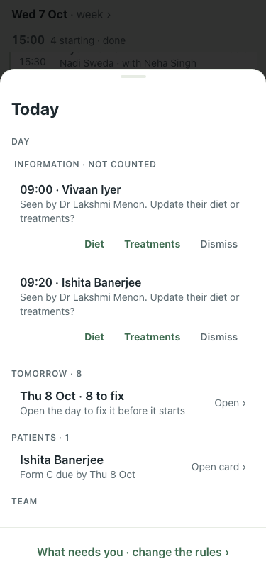
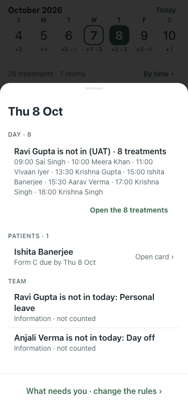

# UAT 2026-10-07-458-after

Base http://localhost:8140, 375x812. Written by scripts/uat.mjs.

| # | Step | Result | Read off the page | Shot |
|---|---|---|---|---|
| 01 | Evening on today: the Menu counts tomorrow's treatment with no therapist | pass | badge "9"; menu: Menu · 9 need you · Things to fix or decide |  |
| 02 | The inbox has a Tomorrow section with the count and Open | pass | Thu 8 Oct · 8 to fix · Open the day to fix it before it starts |  |
| 03 | Open moves the day to tomorrow and the inbox shows its problems | pass | Thu 8 Oct · DAY · 8 · Ravi Gupta is not in (UAT) · 8 treatments · 09:00 Sai Singh · 10:00 Meera Khan · 11:00 Vivaan Iyer · 13:30 Krishna Gupta · 15:00 Ishita Banerjee · 15:30 Aarav Verma · 17:00 Krishna Singh · 18:00 Krishna Singh |  |
