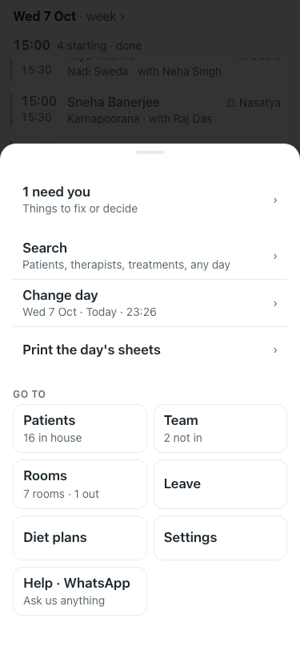
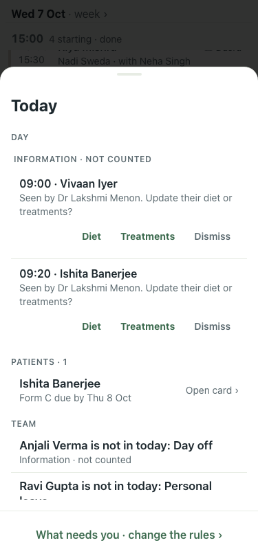

# UAT 2026-10-07-458-before

Base http://localhost:8201, 375x812. Written by scripts/uat.mjs.

| # | Step | Result | Read off the page | Shot |
|---|---|---|---|---|
| 01 | Evening on today: the Menu counts tomorrow's treatment with no therapist | pass | badge "1"; menu: Menu · 1 need you · Things to fix or decide |  |
| 02 | The inbox has a Tomorrow section with the count and Open | FAIL |  |  |
| 03 | Open moves the day to tomorrow and the inbox shows its problems | FAIL | TimeoutError: locator.click: Timeout 5000ms exceeded. Call log:   - waiting for getByRole('dialog').last().getByRole('button', { name: /to fix/ }) |  |
