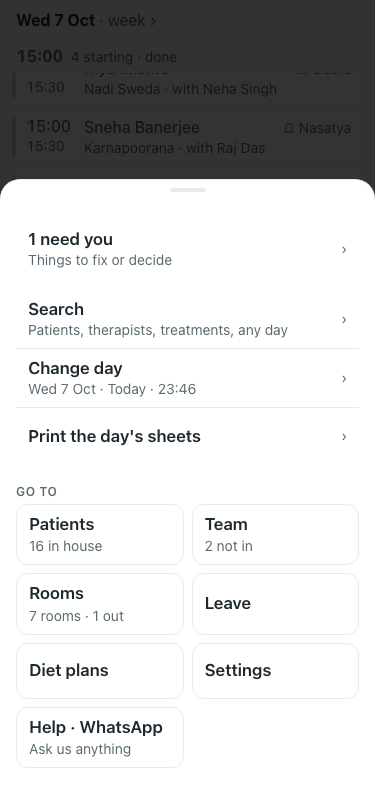
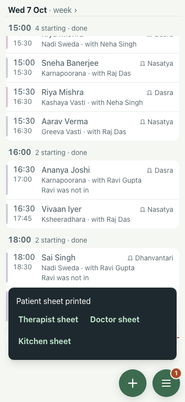

# UAT 2026-10-07-459-before

Base http://localhost:8201, 375x812. Written by scripts/uat.mjs.

| # | Step | Result | Read off the page | Shot |
|---|---|---|---|---|
| 01 | Evening: the Menu's Print row names tomorrow | FAIL | Print the day's sheets · › |  |
| 02 | Print downloads tomorrow's sheet and the toast names the day | FAIL | file ayurcalm-daily-schedule-2026-10-07.pdf; toast "Patient sheet printed" |  |
