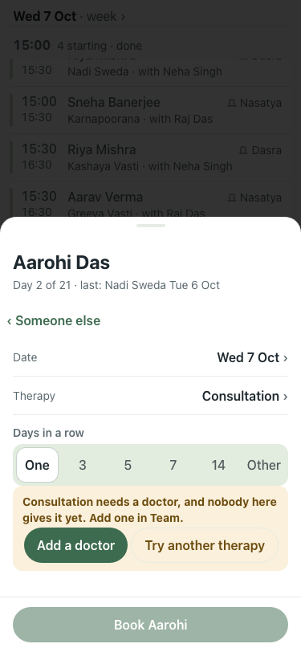
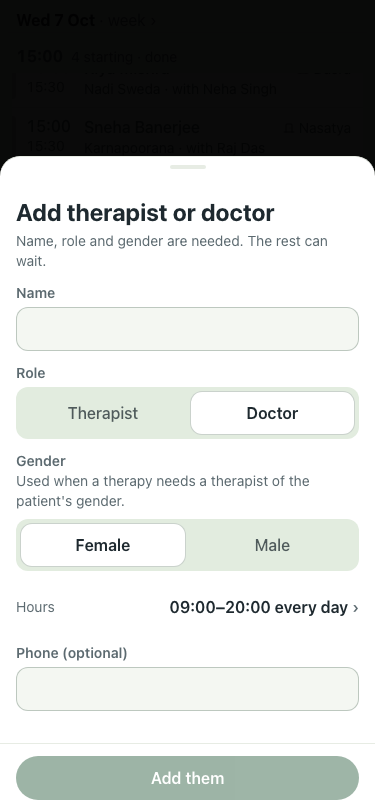
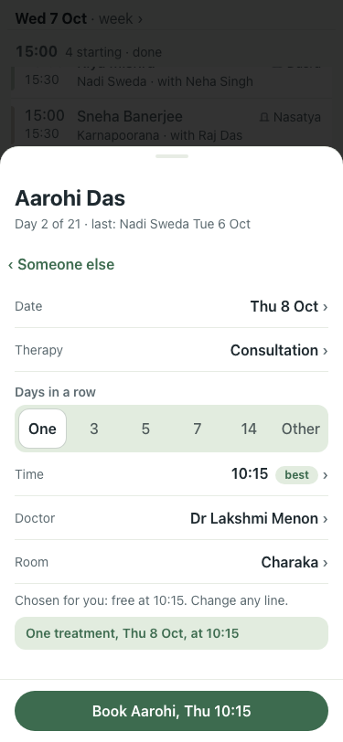

# UAT 2026-10-07-460-after

Base http://localhost:8141, 375x812. Written by scripts/uat.mjs.

| # | Step | Result | Read off the page | Shot |
|---|---|---|---|---|
| 01 | No doctor in: booking a consultation says it needs a doctor, with Add a doctor | pass | Consultation needs a doctor, and nobody here gives it yet. Add one in Team. · Add a doctor |  |
| 02 | Add a doctor opens the form with Doctor chosen | pass | Doctor chosen: true |  |
| 03 | With a doctor in, the booking line reads Doctor | pass | Doctor · Room |  |
