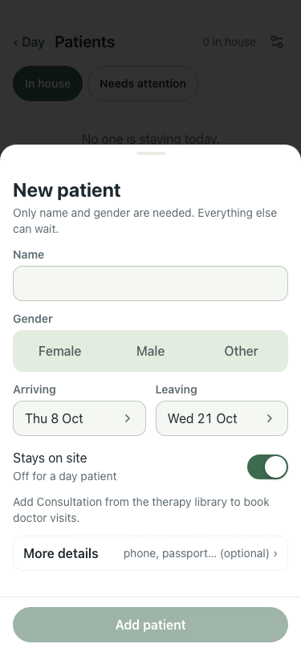

# UAT 2026-10-07-462-after

Base http://localhost:8144, 375x812. Written by scripts/uat.mjs.

| # | Step | Result | Read off the page | Shot |
|---|---|---|---|---|
| 01 | Get started: Add your first patient opens the New patient form | pass | New patient ·  |  |
| 02 | An empty Patients list says so and offers Add a patient | pass | No one is staying today. · then New patient |  |
