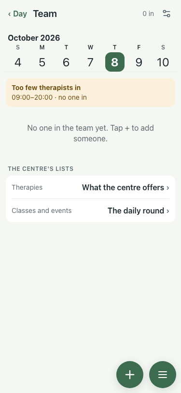
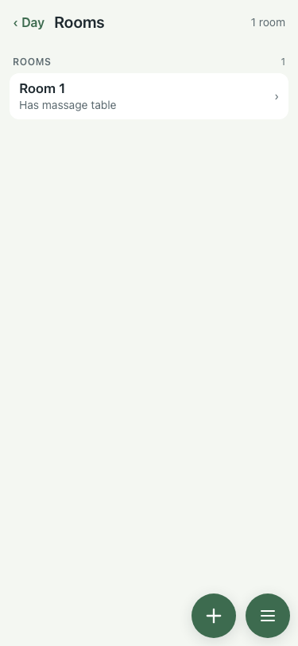
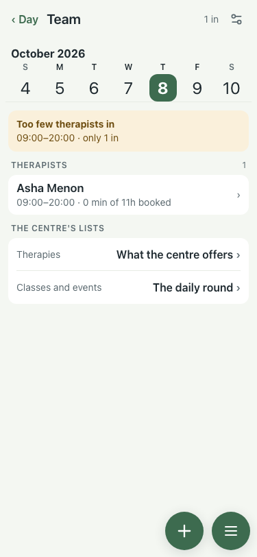
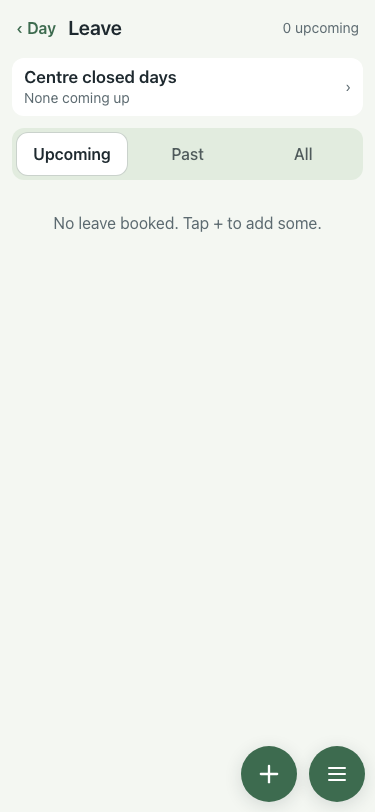

# UAT 2026-10-07-463-after

Base http://localhost:8145, 375x812. Written by scripts/uat.mjs.

| # | Step | Result | Read off the page | Shot |
|---|---|---|---|---|
| 01 | Empty Rooms and Team say "yet" and point at + | pass | No rooms yet. Tap + to add one. · No one in the team yet. Tap + to add someone. |  |
| 02 | One room reads "1 room" | pass | 1 room |  |
| 03 | A therapist with nothing booked is not called "lightly booked" | pass | 09:00–20:00 · 0 min of 11h booked |  |
| 04 | Empty Leave says Tap + to add some | pass | No leave booked. Tap + to add some. |  |
