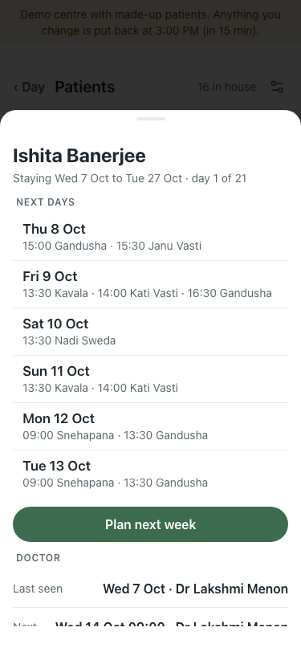
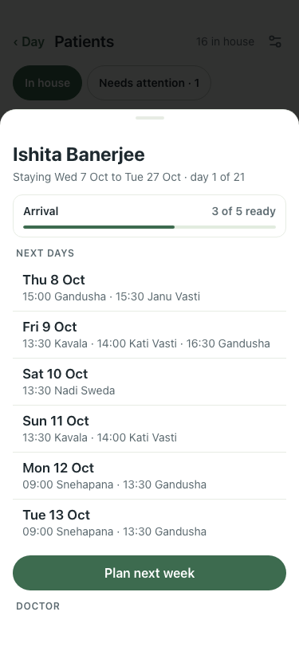
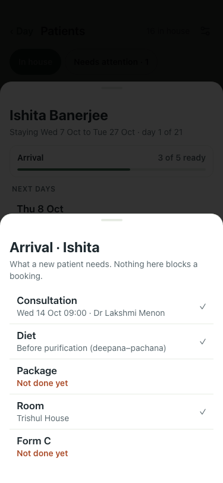

# #422: arrival checklist on the patient card (7 Oct)

| Step | What | Result | Shot |
|---|---|---|---|
| 1 | Before (:8201, main): Ishita Banerjee, day 1 of 21 | no arrival progress on the card |  |
| 2 | After (:8142): same patient | "Arrival · 3 of 5 ready" bar under the stay line |  |
| 3 | Tap the bar | Consultation ✓ (Wed 14 Oct 09:00), Diet ✓, Package not done, Room ✓ (Trishul House), Form C not done; each row opens its own line |  |

Shown on the first three days or until the vitals are written, as the Arrival notes are. Room only for a patient staying on site; Form C only for a foreign guest. Leaving day shows the discharge bar instead.
