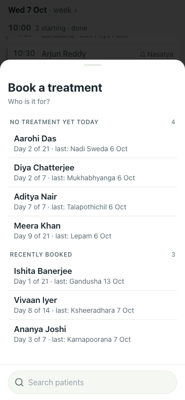
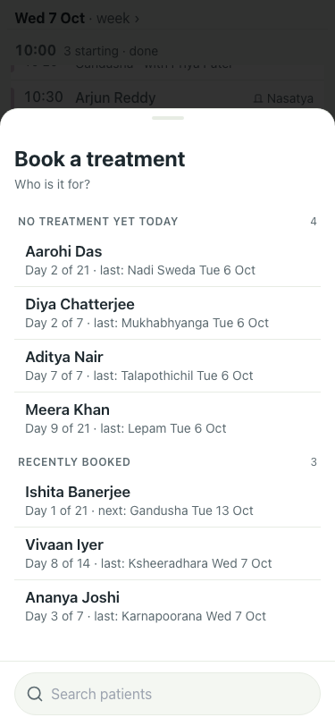

# Booking sheet: "next:" for a booking still ahead (#395)

Lite seed, 7 Oct, 375x812. Ishita Banerjee arrived today; her only treatment is Gandusha on 13 Oct.

| # | Check | Result | Shot |
|---|---|---|---|
| 01 | Before (main): "Day 1 of 21 · last: Gandusha 13 Oct", a future booking called last, no weekday | baseline |  |
| 02 | After: "Day 1 of 21 · next: Gandusha Tue 13 Oct"; every other row "last: … Tue 6 Oct" with its weekday | pass |  |
