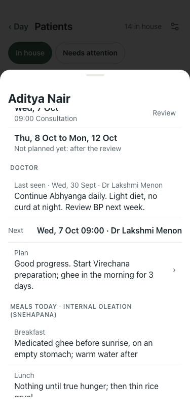
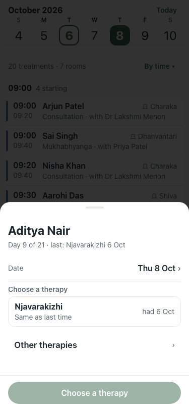

# Patient card and Diet: review around the weekly doctor review (#350)

Lite seed, 375 × 812, 6 Oct (centre day). Every sheet scrolled to its end. Before shots in `before/`,
after the first fix in `after/`. Walked on Ishita Banerjee (arrives today) and Aditya Nair (day 7 of 21,
review tomorrow 7 Oct, nothing booked 8 to 13 Oct: the premise reproduces).

## Taps per job (from the open card)

| Job | Before | Target (story 14) |
|---|---|---|
| See what is booked this week | not possible on the card; Day screen, swipe a day, find them: ~2 per day, 14 for a week | 0 (after: 0, one scroll) |
| Read what the doctor said at the last review | not shown anywhere on the card (note lives on the consultation) | 0 (after: 0) |
| Book next week after the review (2 therapies, same as this week) | Therapies → therapy → Days in a row → 7 → Book, twice: 10 | 3: Plan next week → check → Book all |
| Write the doctor's plan | Plan → type → Save: 2 + typing; leads to nothing | same, beside Plan next week |
| Change the diet from a date | Diet → plan → Start: 3 | 3 (meets story 7) |
| Edit a plan's meals | Menu → Diet plans → plan → scroll 3 screens → Save: 4 | 4 |

## Findings

**Broken**
1. The card shows only today. The week the doctor planned, and the days nobody booked, are invisible. Aditya: review tomorrow, then six empty days. *Fixed in this PR: "Next days".*
2. The last review's note ("Continue Abhyanga daily. Light diet, no curd at night") is on the consultation and is shown nowhere. *Fixed: under Doctor, Last seen.*
3. The doctor's plan is free text that leads to no booking: nothing turns "Start Virechana preparation" into treatments.

**Hard**
4. Booking the next week is one therapy at a time, from the Day screen: 10 taps for two therapies that are the same as this week (the usual case: same week, one swap).
5. The card is three screens: Arrival and four meal rows sit above the Doctor section; the plan is on screen two.
6. The diet picker sits below the fold under long descriptions; "Edit this plan" appears only after a plan is chosen.
7. A plan template is 11 boxes over three screens; Medication and the two treatment notes on a template are per-patient facts.

**Off-design**
8. The "Therapies · 2 today" line opens a new booking, not the therapies: a row that says one thing and does another (§7 Change line).
9. Dates mix formats: "6 Oct to 12 Oct", "Tue, 6 Oct 09:20" (comma), "30 Sept" (§8: "Wed 30 Sept").
10. "Meals today · After purification (samsarjana krama)" wraps a caps caption over two lines (§3: captions are never for a needed fact).

## After (this PR)

| Step | Result | Shot |
|---|---|---|
| Card, Aditya: Next days from tomorrow; review day marked; empty days after the review folded into one row | pass |  |
| Last seen shows the review's note | pass |  |
| Tap "Not planned yet" opens booking on Thu 8 Oct for Aditya | pass |  |
