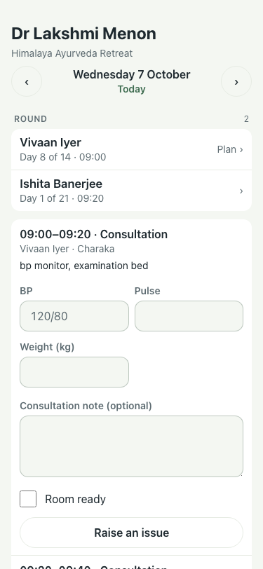
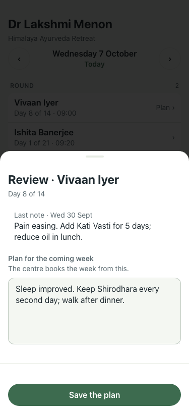
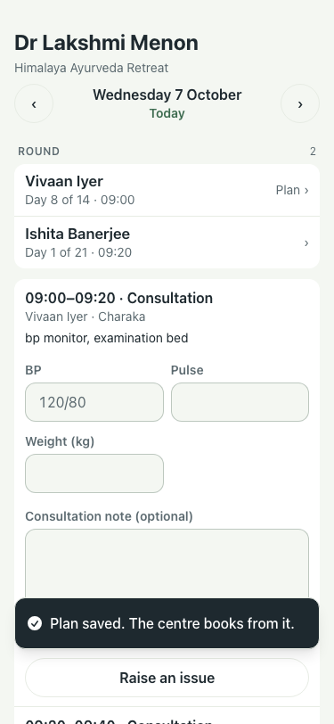

# #423 UAT, 7 Oct (lite seed)

Before (main): the doctor's link lists only their booked consultations and the discharge summaries; nothing says who is due a review. Not shot, to keep :8201 read only.

| # | Step | Result | Read | Shot |
|---|---|---|---|---|
| 01 | Dr Lakshmi Menon's link opens with the Round: who is due a review today, and when | pass | ROUND · 2 · Vivaan Iyer · Day 8 of 14 · 09:00 · Plan › |  |
| 02 | Tapping a patient shows the last note and a plan box | pass | Review · Vivaan Iyer ·  · Day 8 of 14 ·  · Last note · Wed 30 Sept · Pain easing. Add Kati Vasti for 5 days; reduce oil in lunch. |  |
| 03 | Save keeps the plan as the patient's, which the card and Plan next week show | pass | Vivaan Iyer: Abhyanga daily; Shirodhara on alternate days; review in a week |  |
