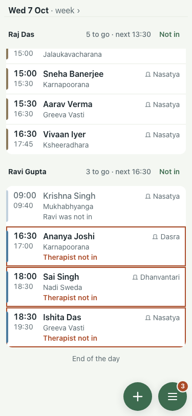
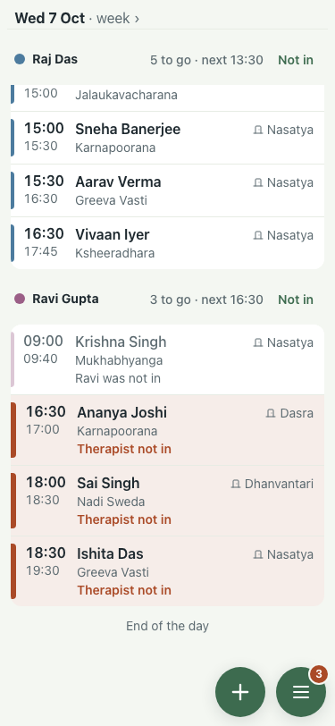
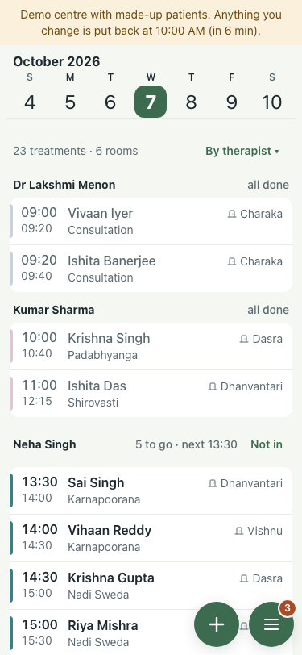
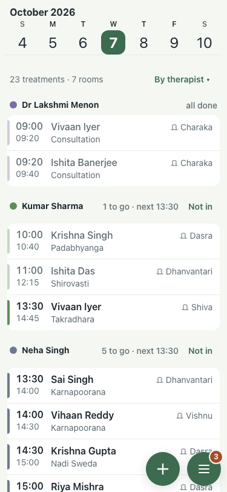
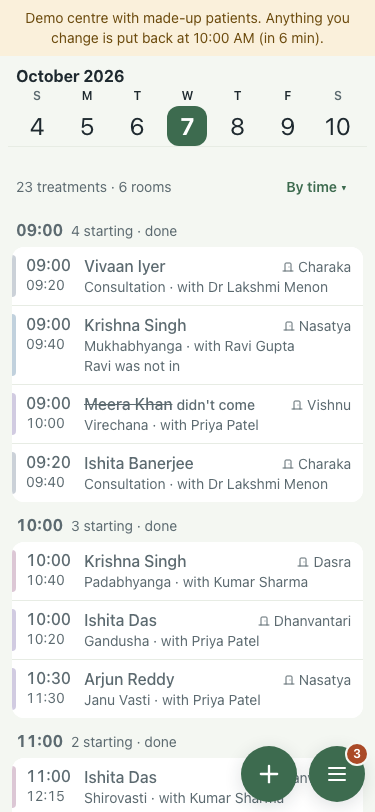
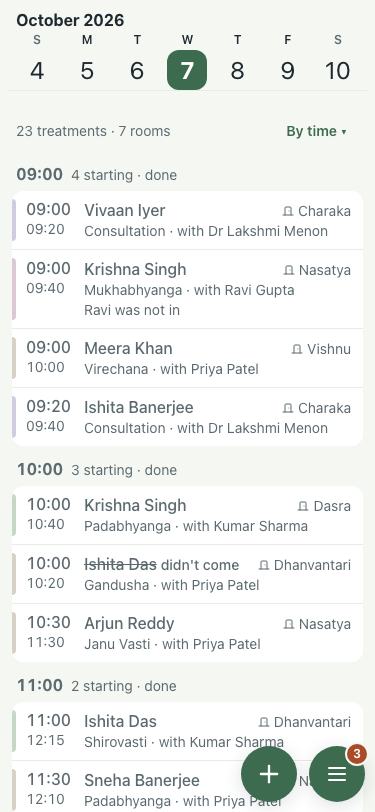

# #430 UAT, 7 Oct (lite seed, 375x812)

Before is the :8201 demo (main); after is the branch on :8130.

| Check | Result | Before | After |
|---|---|---|---|
| Three flagged rows in a row (Ravi Gupta, by therapist): whole on every side, read as three | pass |  ring cut by the stripe, doubled edges |  red stripe, pale red fill, hairlines between |
| The stripe is explained: a dot of the therapist's colour beside each name | pass |  |  |
| By time, unflagged rows unchanged | pass |  |  |
