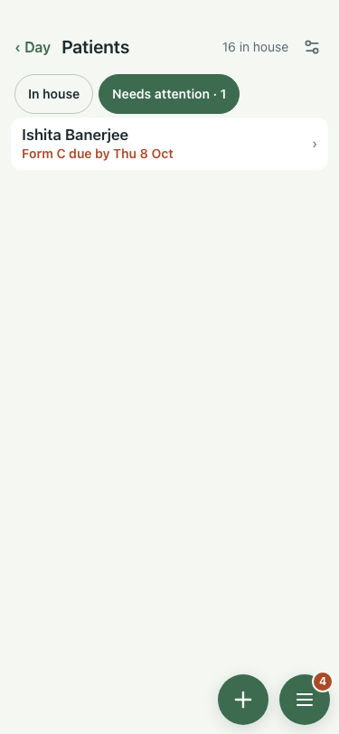
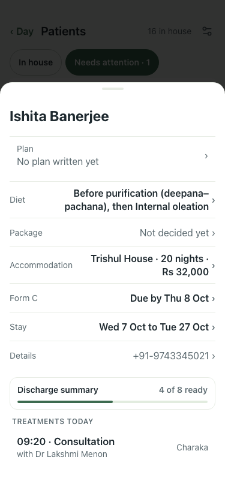
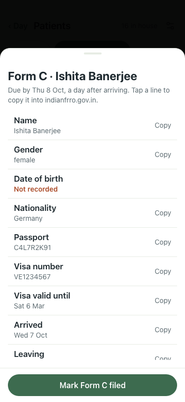
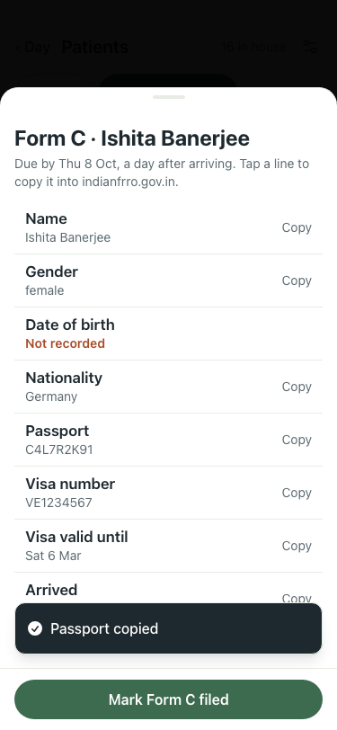
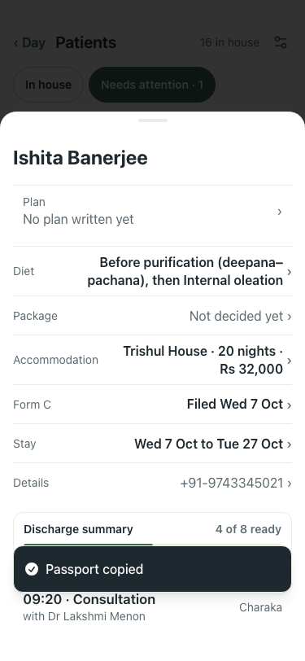

# #415 UAT, 7 Oct (lite seed)

The seed's foreign guest (arrived today, from Germany) at 375x812.

Before (main, :8201): Needs attention has no Form C line, and the card has no Form C.

| # | Step | Result | Read | Shot |
|---|---|---|---|---|
| 01 | Needs attention lists the foreign guest: Form C due by tomorrow | pass | Ishita Banerjee · Form C due by Thu 8 Oct |  |
| 02 | Their card has a Form C row with the due day | pass | Form C Due by Thu 8 Oct |  |
| 03 | The Form C sheet: each field in the FRRO order, tap to copy | pass | Form C · Ishita Banerjee ·  · Due by Thu 8 Oct, a day after arriving. Tap a line to copy it into indianfrro.gov.in. ·  · Name · Ishita Banerjee · Copy · Gender |  |
| 04 | Tapping Passport copies it | pass | clipboard: C4L7R2K91 |  |
| 05 | Marked filed: the row says Filed | pass | Form C Filed Wed 7 Oct |  |
