# Fresh-eyes walk, 7 Oct (lite seed, main after #399–#401)

375x812, signed in by token, about 12:20 IST. Every shot read; the day sheet read with pdftotext. No console errors.

| # | Story / screen | Result | Shot |
|---|---|---|---|
| 01 | 1 Morning glance: day list, pill 4 | pass; 4th problem is a seeded room clash (#404) | 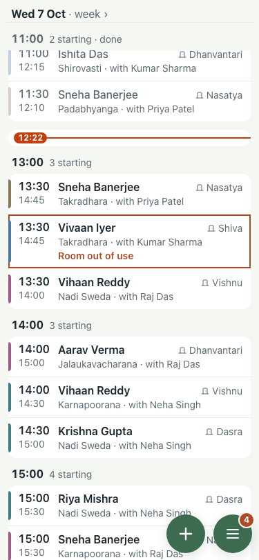 |
| 02 | Menu: need you, Search, Change day, Print | pass | 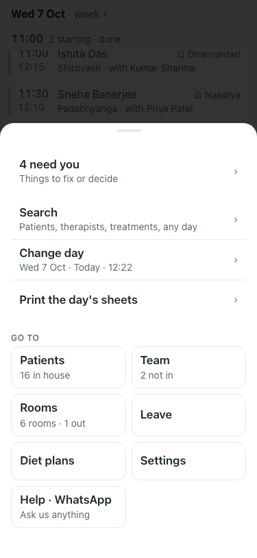 |
| 03–04 | Inbox: Fix all 4, notes, team information | pass |  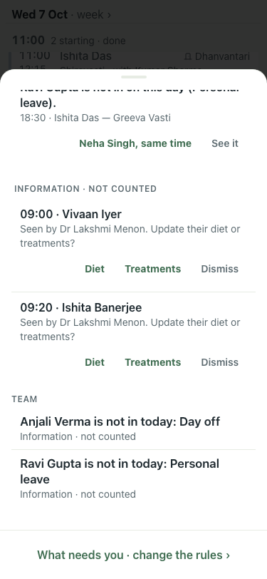 |
| 05 | 2 Print the day's sheets (menu row); PDF read | pass; purification notes on the wrong patients (#403) |  |
| 06 | 3 Therapist dropped out: card offers Neha Singh, same time | pass | 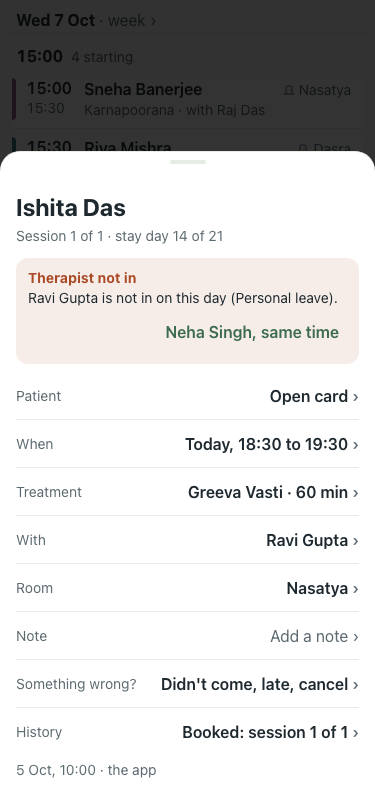 |
| 07–08 | 4 Add a patient: Patients, + New patient | pass; dates lack weekday (#405) | 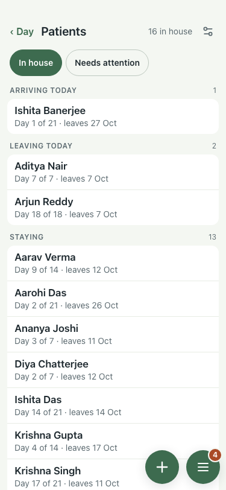 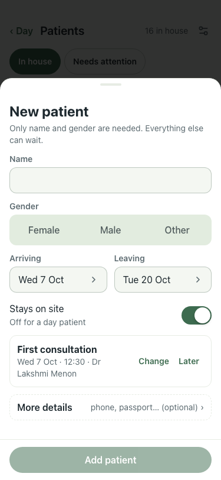 |
| 09–11 | 5 Book: + → patient → therapy → "Book Aarohi, 12:30" | pass | 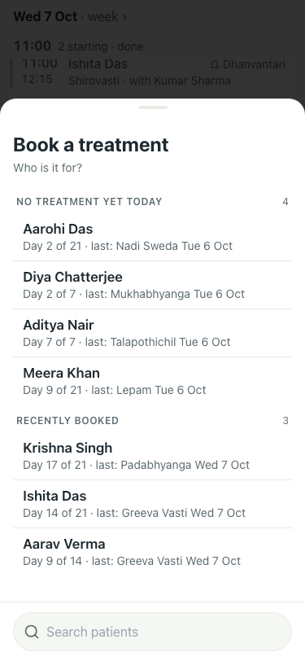 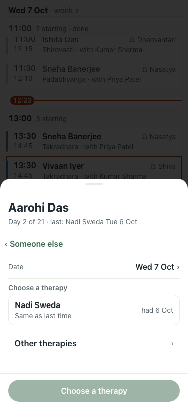 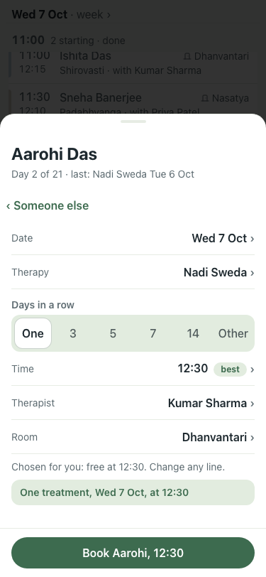 |
| 12 | 6 Search "Meera": upcoming by day | pass | 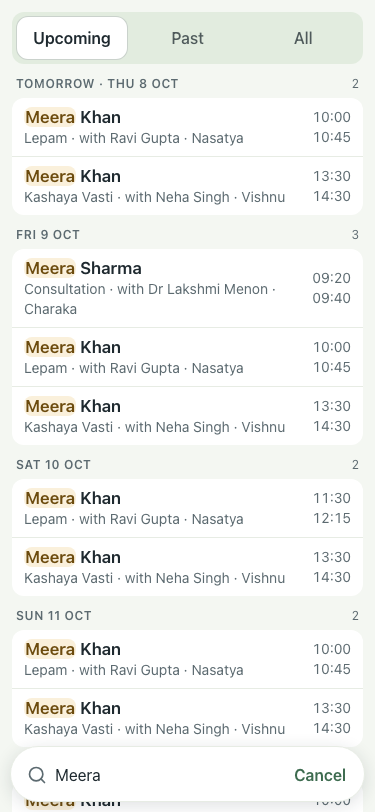 |
| 13–15 | 10–12, 14 Patient card: next days, Plan next week, package, stay, discharge bar | pass; "Staying 7 Oct to 27 Oct" (#405) | 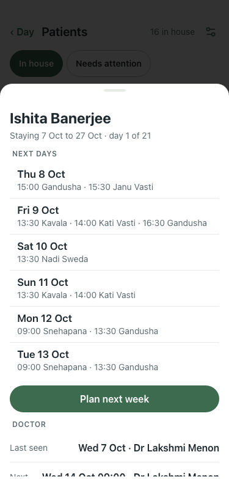 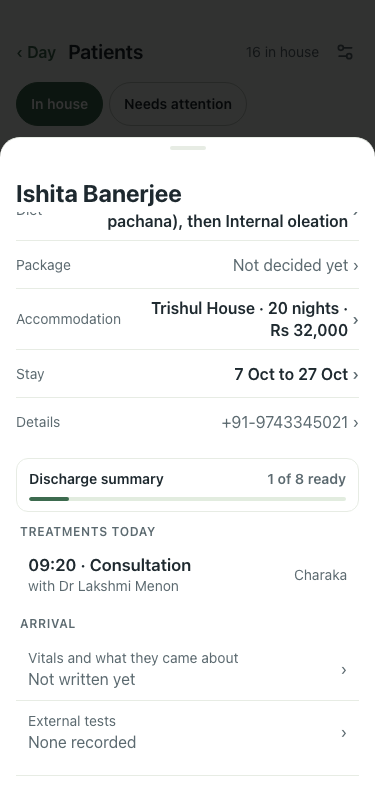 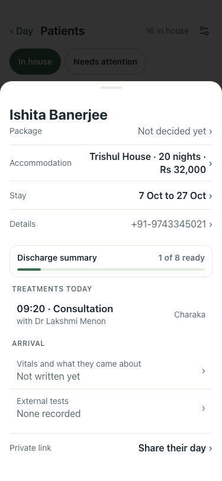 |
| 16 | 7 Meals: diet segments by date | pass | 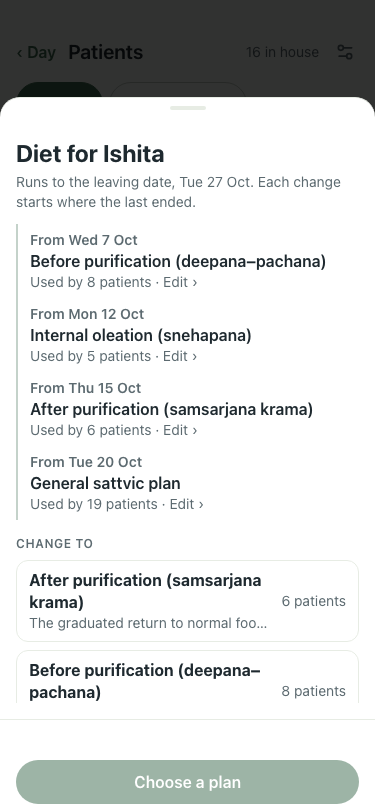 |
| 17 | 8 Discharge: leaving-today card | pass; 'book one' and bar below the fold (#406) | 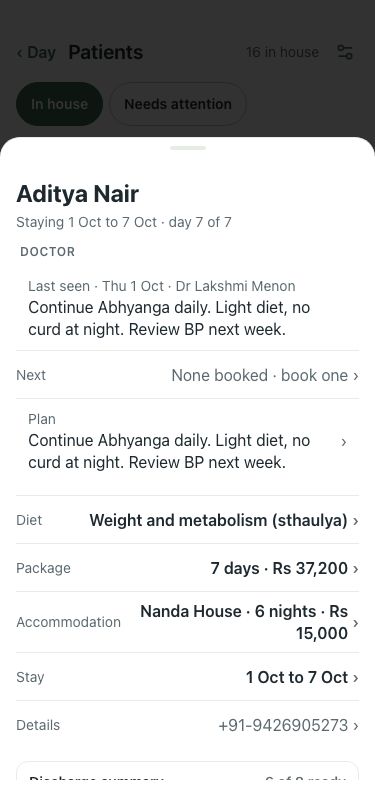 |
| 18–19 | 9 Leave list and New leave | pass | 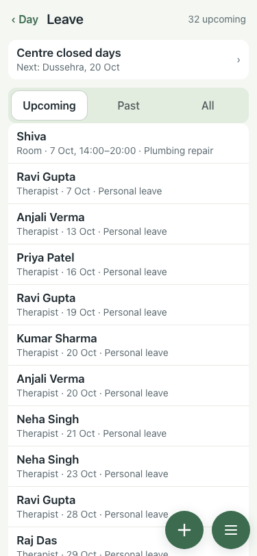 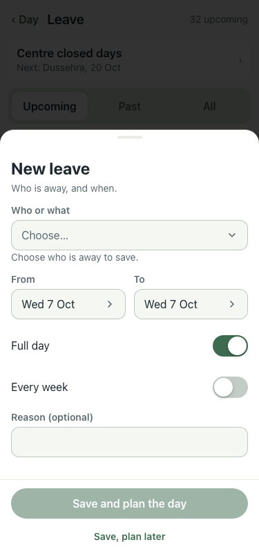 |
| 20–21 | 13 Team: who is in, hours, workload | pass | 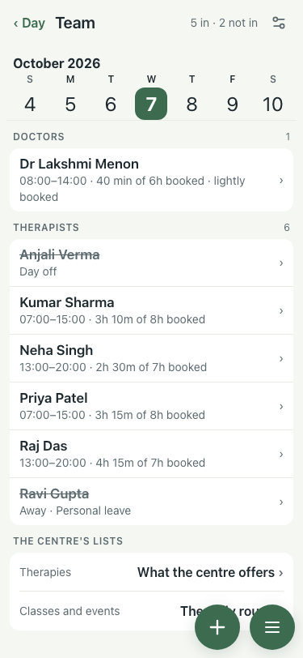 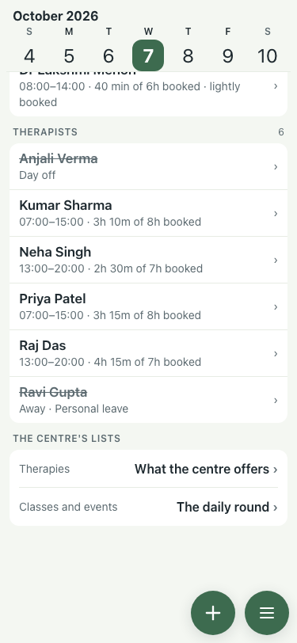 |
| 22–24 | Rooms, Diet plans, Settings | pass | 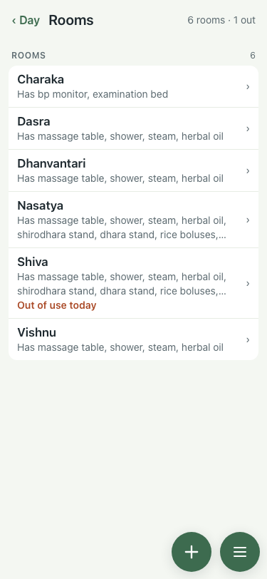 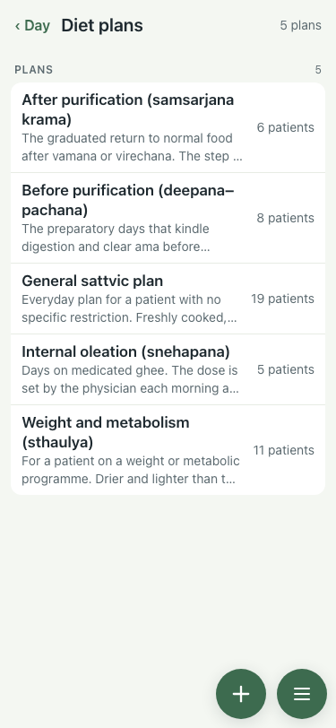 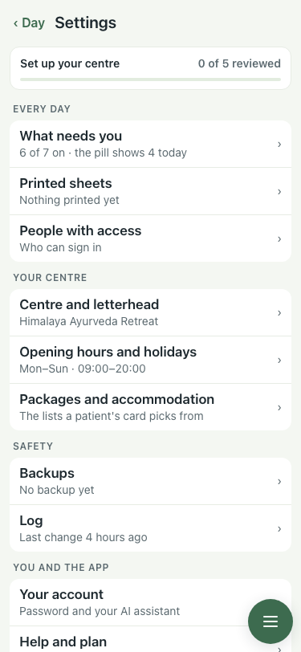 |
| 27 | Log | FAIL: "didn't come" at 08:00 for a 09:00 (#402, fixed next) |  |

Not walked: tomorrow and yesterday by the week strip (the walk script's tap missed; covered by smoke).
