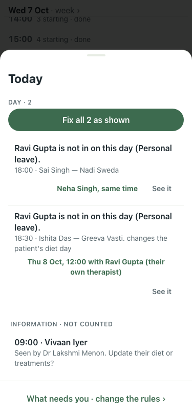
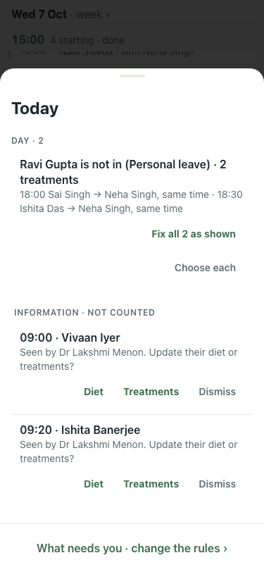
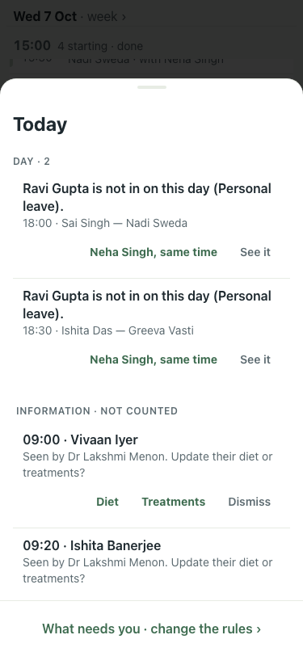
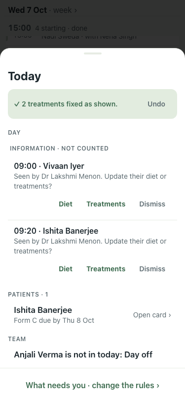

# #418 UAT, 7 Oct (lite seed)

The inbox at 375x812 with Ravi Gupta on leave and two of his treatments still on his name.

| # | Step | Result | Shot |
|---|---|---|---|
| 00 | Main (:8201): two rows, each repeating "Ravi Gupta is not in on this day" | before |  |
| 01 | One row: "Ravi Gupta is not in (Personal leave) · 2 treatments", each move listed, Fix all 2 as shown | pass |  |
| 02 | Choose each opens the two rows as before | pass |  |
| 03 | Fix all: both moved in one batch, one Undo | pass |  |
