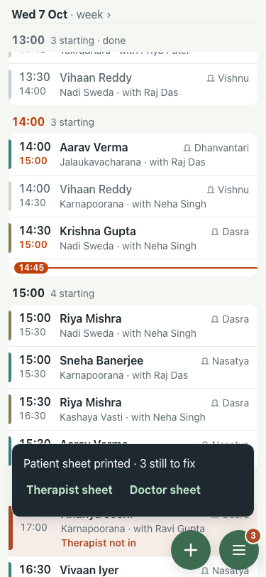
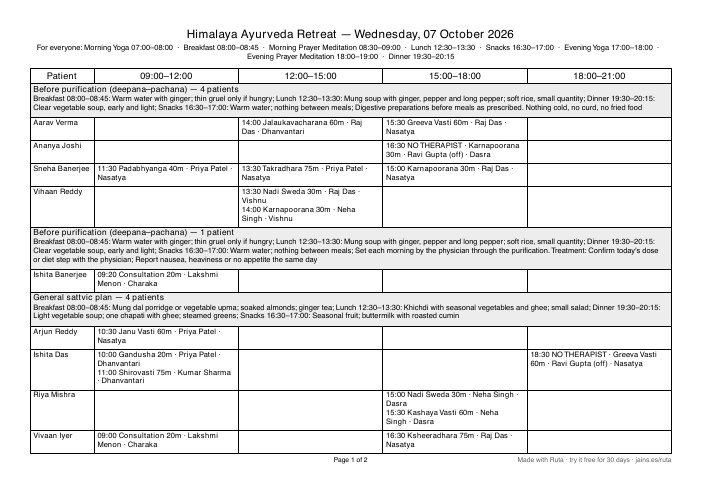
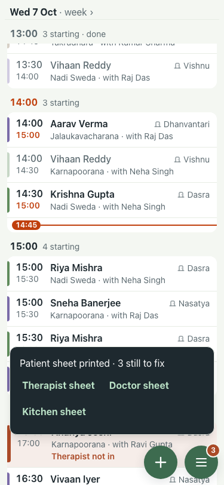
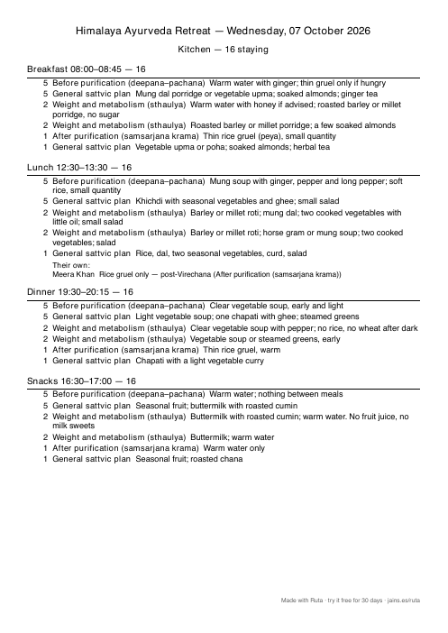
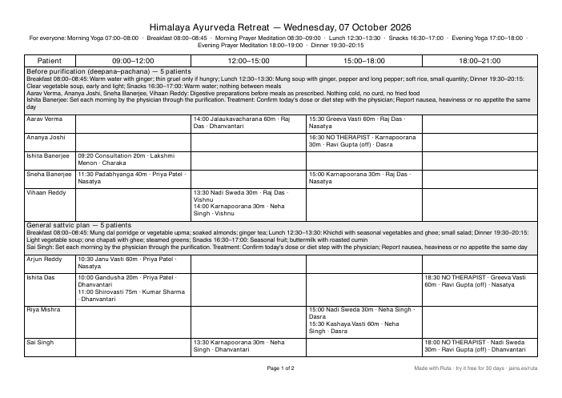

# #414 UAT, 7 Oct (lite seed)

Before (main): the toast offers Therapist and Doctor sheets only, and the day sheet prints a plan twice when one patient's medication differs.

 

| # | Step | Result | Read | Shot |
|---|---|---|---|---|
| 01 | The print toast offers Kitchen sheet | pass | Patient sheet printed · 3 still to fix · Therapist sheet · Doctor sheet · Kitchen sheet |  |
| 02 | Kitchen sheet: one page, counts per plan for each meal, then exceptions by name | pass | Lunch 12:30–13:30 — 16 |  |
| 03 | Day sheet: one group per plan and side, own notes by name | pass | Before purification (deepana–pachana) — 5 patients / General sattvic plan — 5 patients / General sattvic plan — rest day — 1 patient / Weight and metabolism (sthaulya) — 2 patients / Weight and metabolism (sthaulya) — rest day — 2 patients / After purification (samsarjana krama) — changed for today — 1 patient |  |
