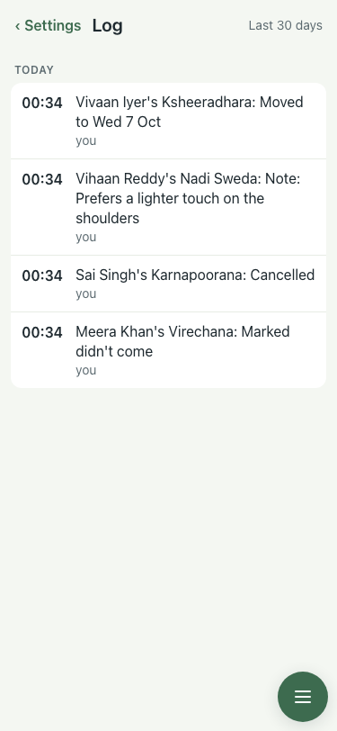
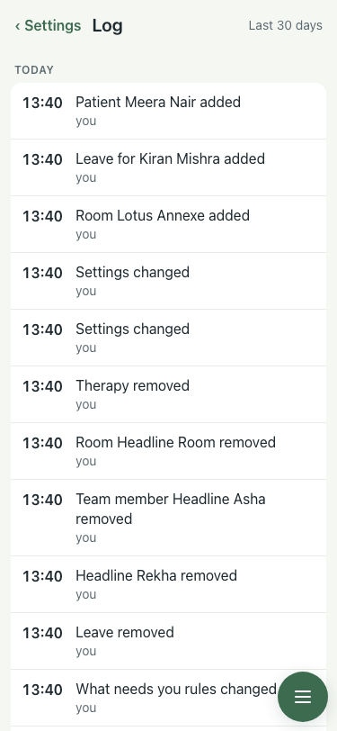

# #411 UAT, 7 Oct (full seed)

Before (Task B, s22-01): after a walk that added a patient, four bookings and a leave, the Log showed only the four seeded rows.

| # | Step | Result | Read | Shot |
|---|---|---|---|---|
| 01 | The Log after a room, a leave and a patient are added | pass | Patient Meera Nair added · Leave for Kiran Mishra added · Room Lotus Annexe added |  |
