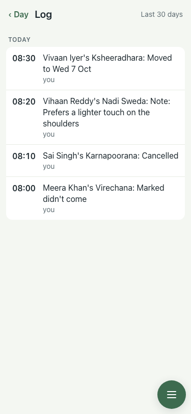
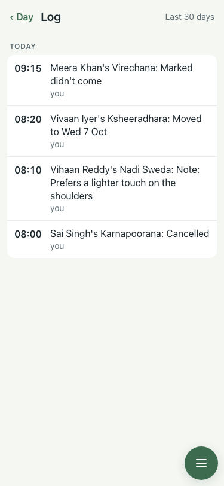

# Demo seed: no-show logged after its treatment starts (#402)

Lite seed, 7 Oct, 375x812.

| # | Check | Result | Shot |
|---|---|---|---|
| 01 | Before (main after #401): "08:00 Meera Khan's Virechana: Marked didn't come" for a 09:00 treatment | baseline |  |
| 02 | After: no-show at 09:15; cancel, note, move at 08:00–08:20 | pass |  |
