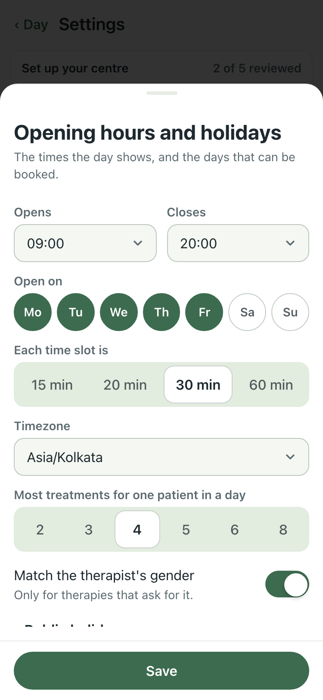
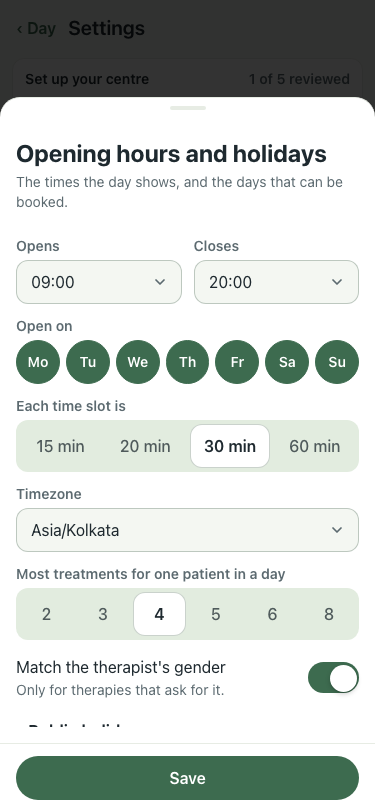
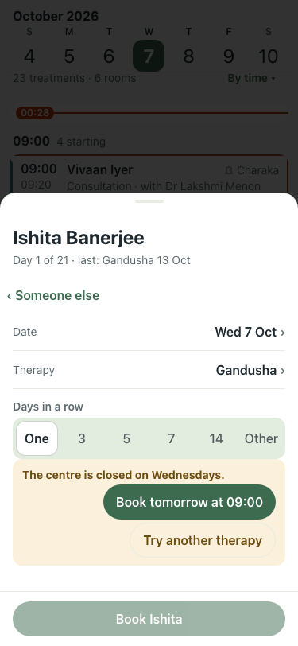

# Open days enforced, seven by default (#393), 375×812, lite seed

| # | Check | Result | Shot |
|---|---|---|---|
| 01 | Before (6 Oct walk): Opening hours says Mon–Fri, yet the demo books Sat and Sun | baseline |  |
| 02 | After: the migrated demo is open Mo–Su | pass |  |
| 03 | After, Wednesday unticked: + → Ishita → Gandusha on Wed 7 Oct says "The centre is closed on Wednesdays." with "Book tomorrow at 09:00" (Thu 8 Oct) and "Try another therapy" | pass |  |

Wednesday was ticked again afterwards. qa 39/39 (offHours now covers a closed weekday and a centre closed day), smoke 6/6.
