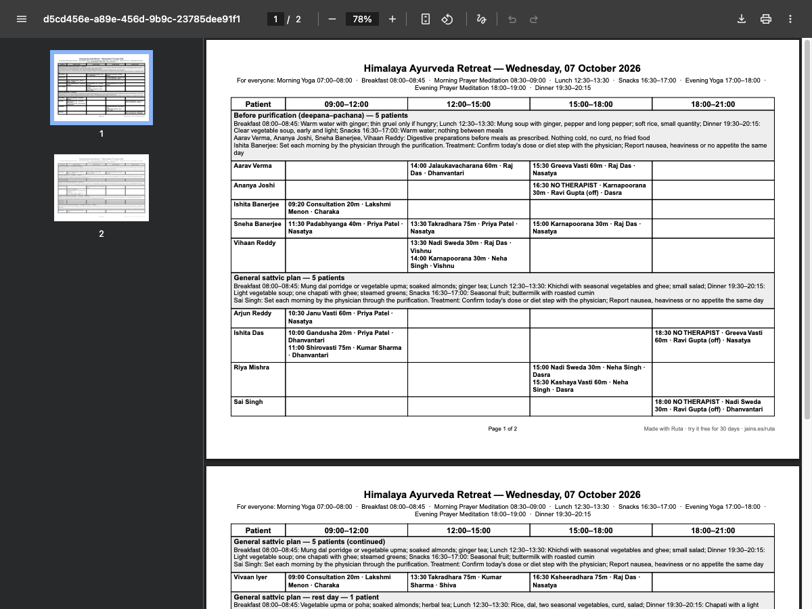
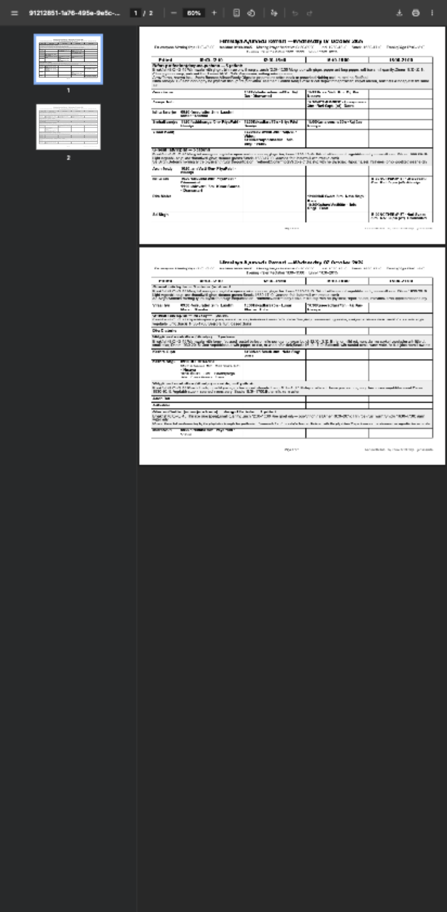
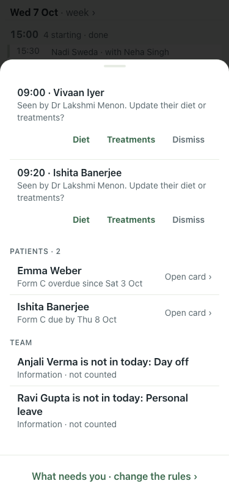

# #448: day sheet PDF under the security header, Form C findings (7 Oct)

| Step | What | Result | Shot |
|---|---|---|---|
| 1 | Day sheet opened in a new tab as the app does it (blob), real Google Chrome, desktop, :8201 with `object-src 'none'` | pass, viewer shows both pages |  |
| 2 | Same, Chrome with Pixel 7 emulation | pass, viewer shows both pages |  |
| 3 | Before (:8201, main): a German guest who left yesterday, Form C never filed | no Form C row |  |
| 4 | After (:8140, this branch): same guest | "Emma Weber · Form C overdue since Sat 3 Oct" |  |

Not checked: iOS Safari (needs a real iPhone; goes with #425). Same check with `object-src` removed rendered identically, so the header stays as it is.
