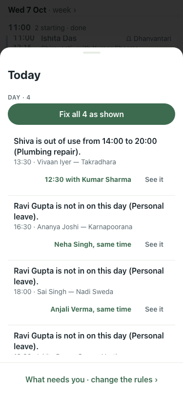
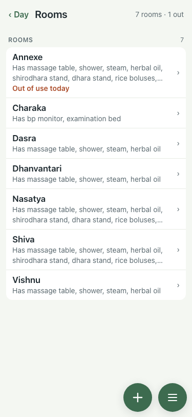
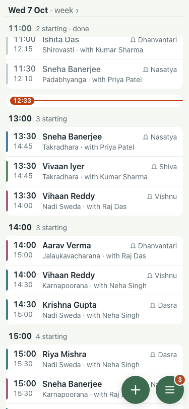

# Demo seed: the room repair no longer clashes with a 13:30 (#404)

Lite seed, 7 Oct, 375x812.

| # | Check | Result | Shot |
|---|---|---|---|
| 01 | Before (main): inbox opens on "Shiva is out of use from 14:00" for Vivaan's 13:30–14:45; 4 need you | baseline |  |
| 02 | After: every room has something running past 14:00 on lite, so the seed's own Annexe takes the repair | pass |  |
| 03 | After: Vivaan's 13:30 in Shiva is unflagged; 3 need you, all Ravi's (also 3 on the full seed) | pass |  |
