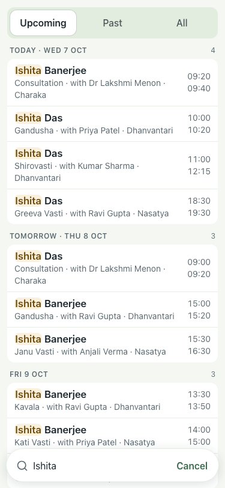
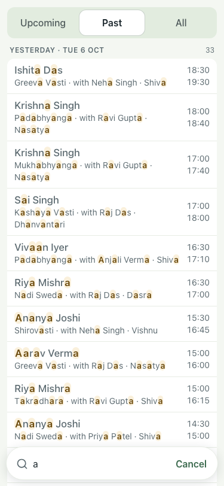
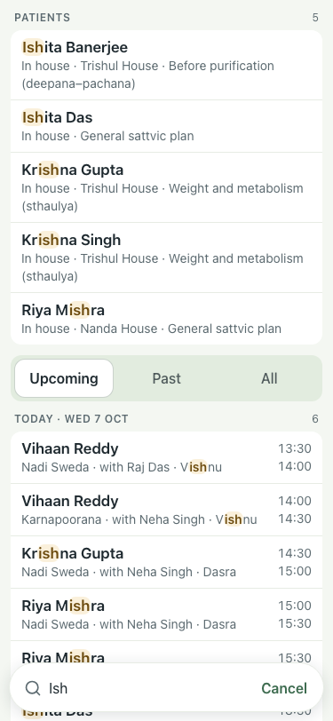
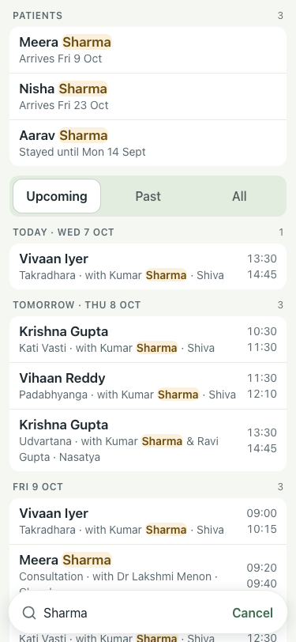
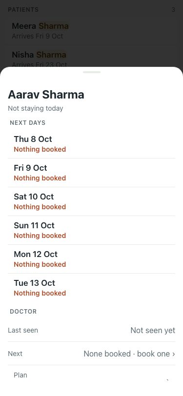

# #412 UAT, 7 Oct

Before (Task B): typed results were treatments only (s15-03), and a past guest's card could not be reached (s34-01).

 

| # | Step | Result | Read | Shot |
|---|---|---|---|---|
| 01 | Typing "Ish" shows a Patients section first, with stay facts | pass | PATIENTS · 5 · Ishita Banerjee · In house · Trishul House · Before purification (deepana–pachana) · Ishita Das · In house · General sattvic plan · Krishna Gupta · In house · Trishul  |  |
| 02 | A past guest (Aarav Sharma) is found by name | pass | PATIENTS · 3 · Meera Sharma · Arrives Fri 9 Oct · Nisha Sharma · Arrives Fri 23 Oct · Aarav Sharma · Stayed until Mon 14 Sept · Upcoming · Past · All · TODAY · WED 7 OCT · 1 · Vivaan Iyer · Takrad |  |
| 03 | Tapping the past guest opens their card | pass | Aarav Sharma · Not staying today · NEXT DAYS · Thu 8 Oct |  |
