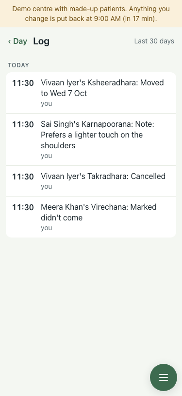
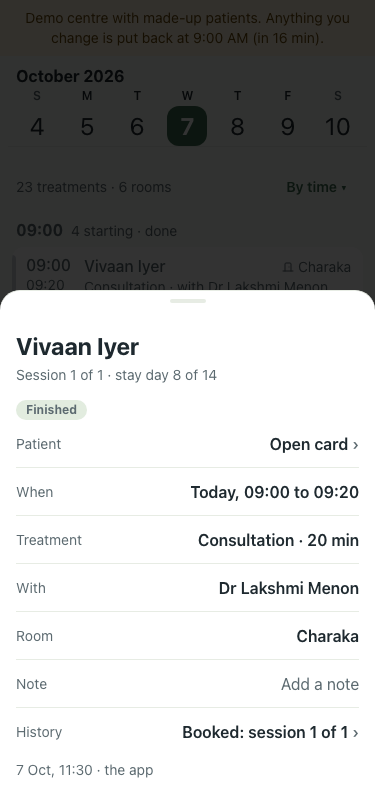
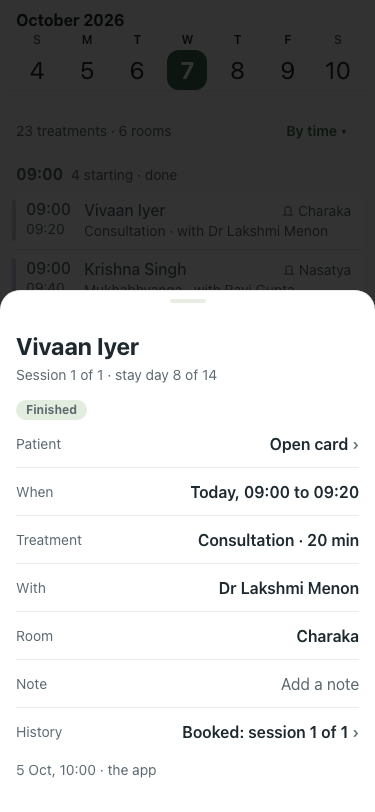

# Demo seed: changes and bookings stamped when they plausibly happened (#396)

Lite seed, 7 Oct about 12:40 IST, 375x812. Before is the demo on main (reset at 11:30).

| # | Check | Result | Shot |
|---|---|---|---|
| 01 | Before: Log lists the four seeded changes at the reset time (11:30), all at once | baseline |  |
| 02 | After: the same four at 08:00, 08:10, 08:20, 08:30 | pass |  |
| 03 | Before: a finished 09:00 consultation reads "Booked … 7 Oct, 11:30", after it happened | baseline |  |
| 04 | After: "Booked … 5 Oct, 10:00", two days ahead | pass |  |
| — | No treatment on a centre closed day (was 3 consultations on Gandhi Jayanti); lite and full seed | pass (SQL count 0) | — |
