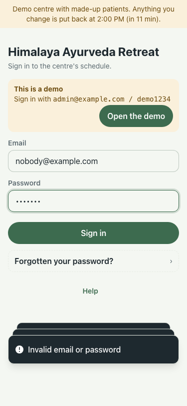
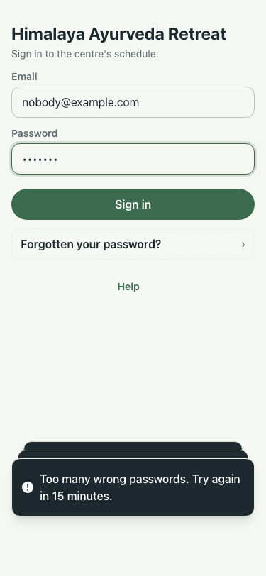
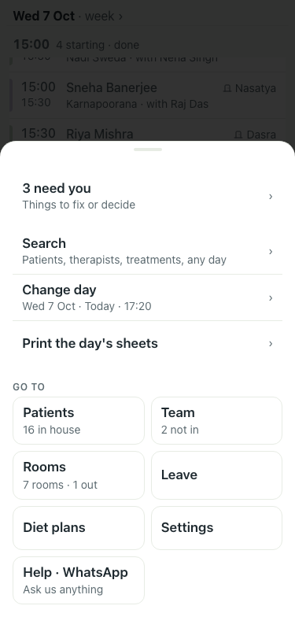

# #417 UAT, 7 Oct (lite seed)

| # | Step | Result | Shot |
|---|---|---|---|
| 00 | Main (:8201): the 11th wrong password is still an ordinary 401 | before |  |
| 01 | Branch: the 11th wrong password says "Too many wrong passwords. Try again in 15 minutes." (429) | pass |  |
| 02 | Signed in, day, Patients, Settings and the Menu open with the security policy on: 0 policy errors in the console | pass |  |
