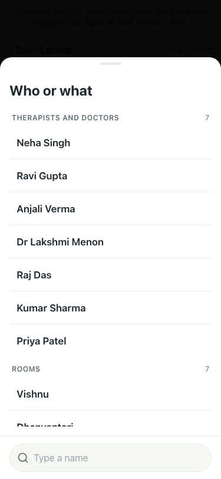
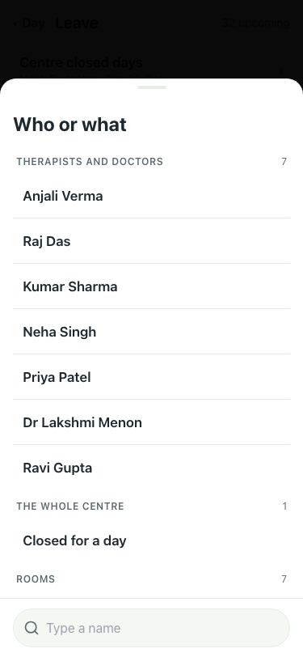
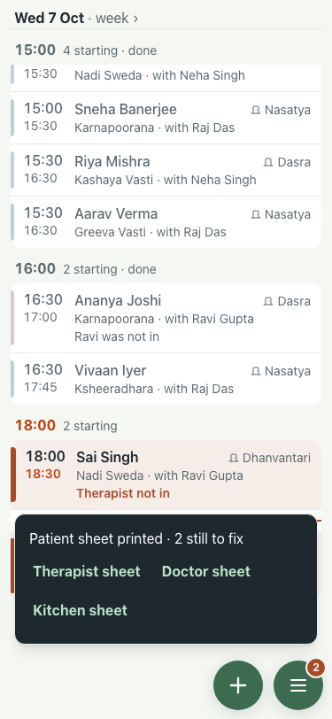
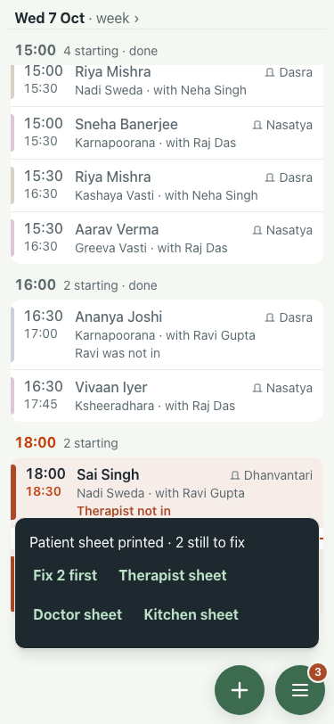
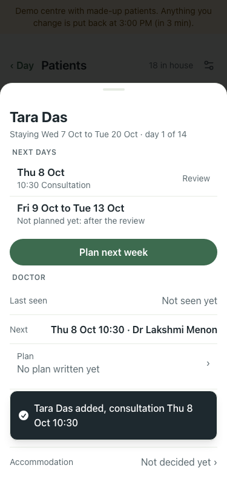
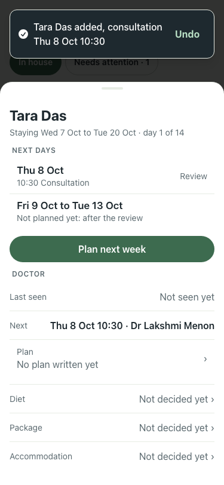
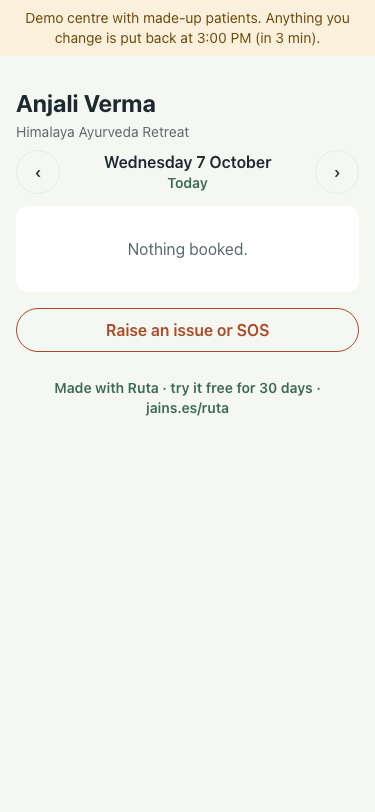
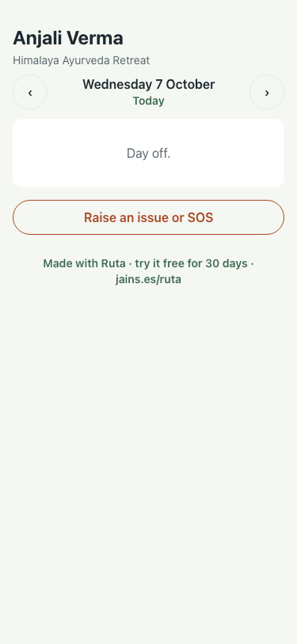
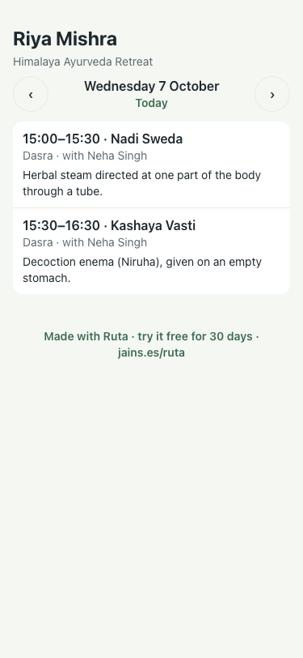
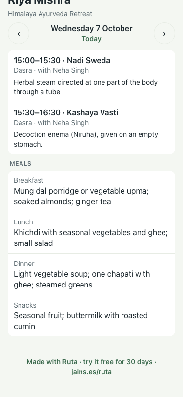

# #424: small fixes from the audit (7 Oct)

Before is :8201 (main), after is :8143 (this branch), both 375x812.

| # | Fix | Before | After | Result |
|---|---|---|---|---|
| 1 | Leave picker: people first, rooms, therapies and patients folded |  |  | pass: therapists, whole centre, then "Show rooms / therapies / patients" |
| 2 | Print toast offers "Fix 2 first" when problems remain |  |  | pass: opens What needs you |
| 3 | Add-patient toast at the top with Undo |  |  | pass: Diet and Package rows no longer covered |
| 4 | A therapist's link on a day off says "Day off." |  |  | pass (Anjali Verma) |
| 5 | Patient link shows the day's meals |  |  | pass (Riya Mishra: four meals) |
| 6 | Medication and notes wraps on the diet sheet (TextRow, not a two-line clamp) | – | – | code only, not shot |
| 7 | No "120/80" or "68 kg" placeholders on vitals or the discharge form | – | – | code only |
| 8 | A two-therapist refusal names who is on it ("needs 2 therapists together (women), and only Priya Patel is on it") | – | – | qa: treatmentCard test |
