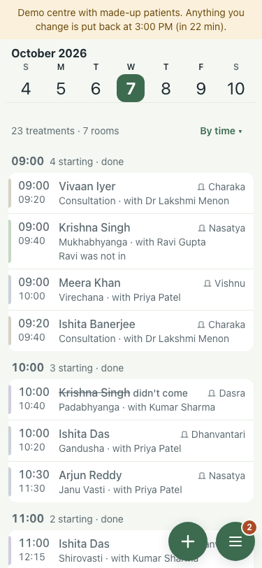
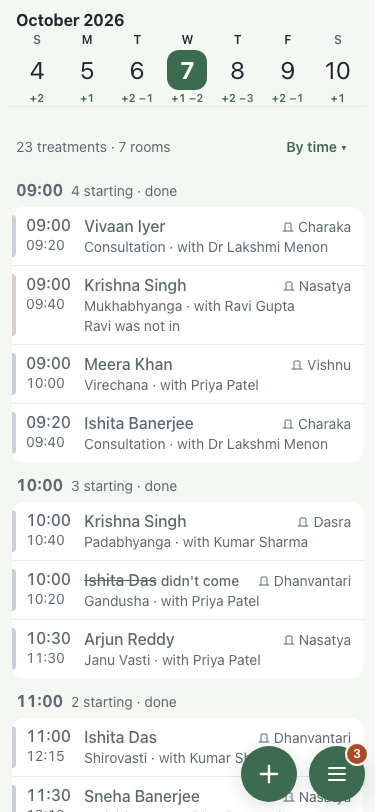

# #421: in and out under each week-strip day (7 Oct)

| Step | What | Result | Shot |
|---|---|---|---|
| 1 | Before (:8201, main): the week strip at 375x812 | dates only |  |
| 2 | After (:8141, this branch): same | +2, +1, +2 −1, +1 −2, +2 −3, +2 −1, +1 for Sun 4 to Sat 10 Oct, matching the stays from `/api/patients` |  |

Green +n is arrivals, grey −n departures; a day with neither stays blank. Tap still opens the day.
