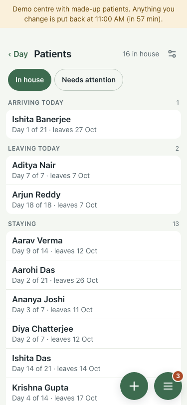
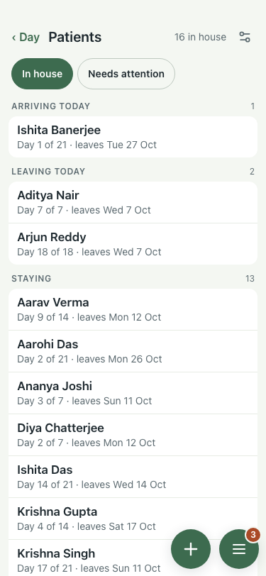
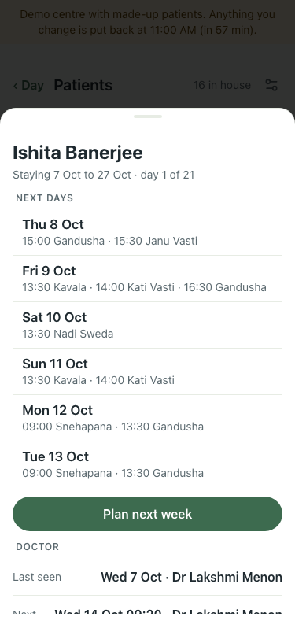
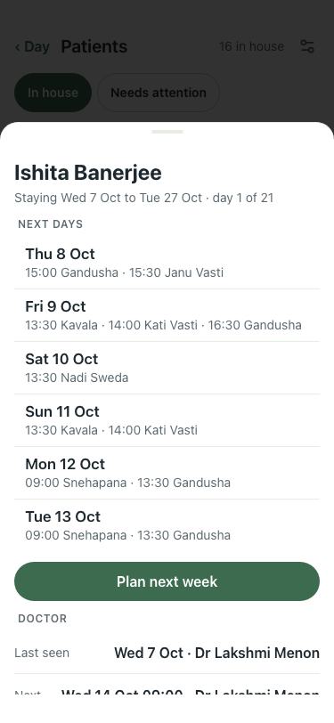
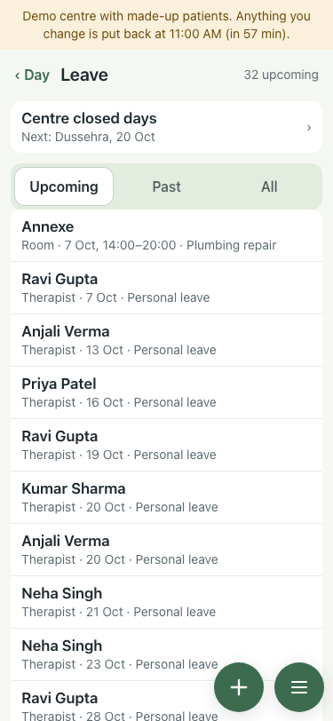
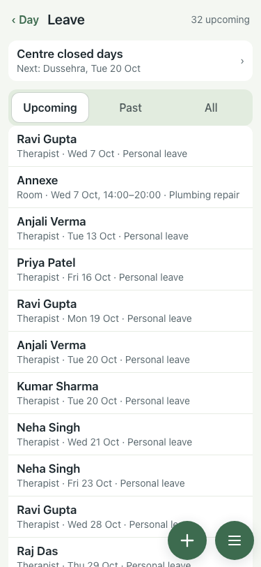

# #405 UAT, 7 Oct (lite seed, 375x812)

Before is the :8201 demo (main); after is the branch on :8131. Every date read off the page.

| Where | Result | Before | After |
|---|---|---|---|
| Patients list | pass | leaves 27 Oct  | leaves Tue 27 Oct  |
| Card header (the Stay row uses the same helper) | pass | Staying 7 Oct to 27 Oct  | Staying Wed 7 Oct to Tue 27 Oct, one line  |
| Leave rows | pass | Therapist · 13 Oct  | Therapist · Tue 13 Oct  |
| Booking therapy facts | pass | had 6 Oct  | had Tue 6 Oct  |
