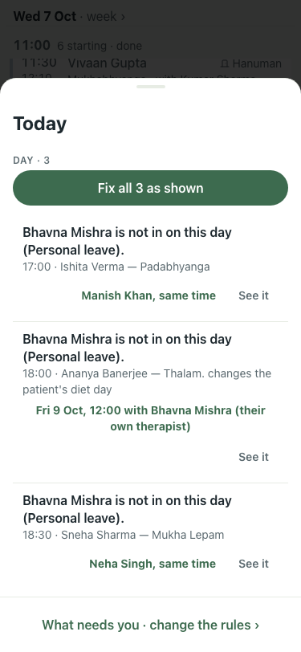
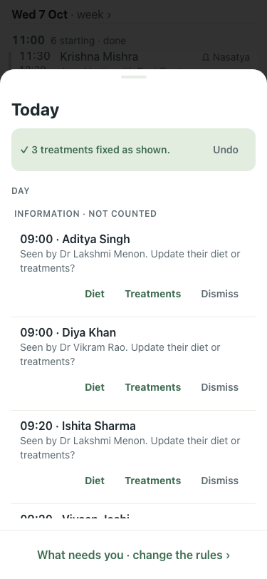
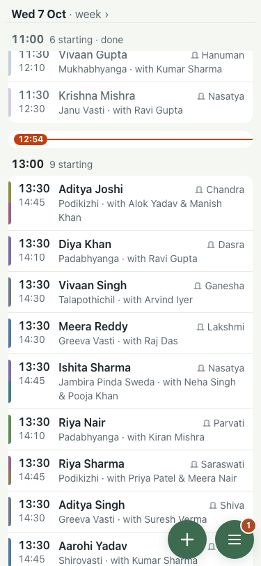

# #409 UAT, 7 Oct (full seed, Wed, a therapist's weekly day off)

Before: Task B shots s2-03 (Fix all refused, 'Anjali Verma does not work on Wednesdays.') and s2-05 (still 5), in the Task B artifact.

| # | Step | Result | Read | Shot |
|---|---|---|---|---|
| 01 | Inbox offers Fix all | pass | Fix all 3 as shown |  |
| 02 | Fix all is accepted, not refused | pass | Undo shown, no refusal |  |
| 03 | The day after: nothing left to fix | pass | 0 blocking problems left |  |
