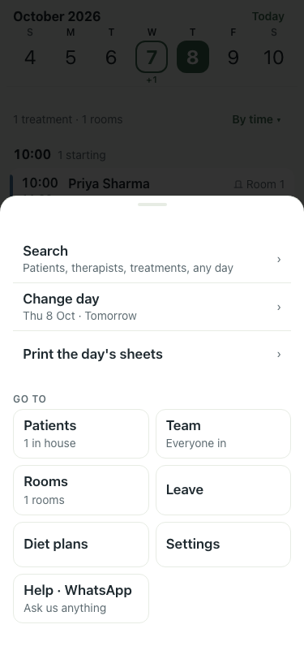

# UAT 2026-10-08-475-before

Base http://localhost:8150, 375x812. Written by scripts/uat.mjs.

| # | Step | Result | Read off the page | Shot |
|---|---|---|---|---|
| 01 | Evening: the Menu counts tomorrow's treatment with no therapist | FAIL | Menu · Search · Patients, therapists, treatments, any day |  |
| 02 | The inbox opens on the Tomorrow section and stays open | FAIL | TimeoutError: locator.click: Timeout 5000ms exceeded. Call log:   - waiting for getByRole('dialog').last().getByRole('button', { name: /need you/ }) |  |
